---
## Front matter
title: "Лабораторная работа 1-B (20_09)"
subtitle: "Кибербезопасность предприятия"
author: 
- Ищенко Ирина 
- Мишина Анастасия 
- Дикач Анна 
- Галацан Николай 
- Амуничников Антон 
- Барсегян Вардан 
- Дудырев Глеб 
- Дымченко Дмитрий

## Generic otions
lang: ru-RU
toc-title: "Содержание"

## Bibliography
bibliography: bib/cite.bib
csl: pandoc/csl/gost-r-7-0-5-2008-numeric.csl

## Pdf output format
toc: true # Table of contents
toc-depth: 2
lof: true # List of figures
lot: true # List of tables
fontsize: 12pt
linestretch: 1.5
papersize: a4
documentclass: scrreprt
## I18n polyglossia
polyglossia-lang:
  name: russian
  options:
  - spelling=modern
  - babelshorthands=true
polyglossia-otherlangs:
  name: english
## I18n babel
babel-lang: russian
babel-otherlangs: english
## Fonts
mainfont: IBM Plex Serif
romanfont: IBM Plex Serif
sansfont: IBM Plex Sans
monofont: IBM Plex Mono
mathfont: STIX Two Math
mainfontoptions: Ligatures=Common,Ligatures=TeX,Scale=0.94
romanfontoptions: Ligatures=Common,Ligatures=TeX,Scale=0.94
sansfontoptions: Ligatures=Common,Ligatures=TeX,Scale=MatchLowercase,Scale=0.94
monofontoptions: Scale=MatchLowercase,Scale=0.94,FakeStretch=0.9
mathfontoptions:
## Biblatex
biblatex: true
biblio-style: "gost-numeric"
biblatexoptions:
  - parentracker=true
  - backend=biber
  - hyperref=auto
  - language=auto
  - autolang=other*
  - citestyle=gost-numeric
## Pandoc-crossref LaTeX customization
figureTitle: "Рис."
tableTitle: "Таблица"
listingTitle: "Листинг"
lofTitle: "Список иллюстраций"
lotTitle: "Список таблиц"
lolTitle: "Листинги"
## Misc options
indent: true
header-includes:
  - \usepackage{indentfirst}
  - \usepackage{float} # keep figures where there are in the text
  - \floatplacement{figure}{H} # keep figures where there are in the text
---

# Цель тренировки

Разобраться с сценарием действий нарушителя "Защита данных сегмента АСУ ТП". Выявить и устранить уязвимости и их последствия.

# Выявленные уязвимости и последствия

По ходу выполнения тренировки были выявлены следующие уязвимости (рис. [-@fig:001]):

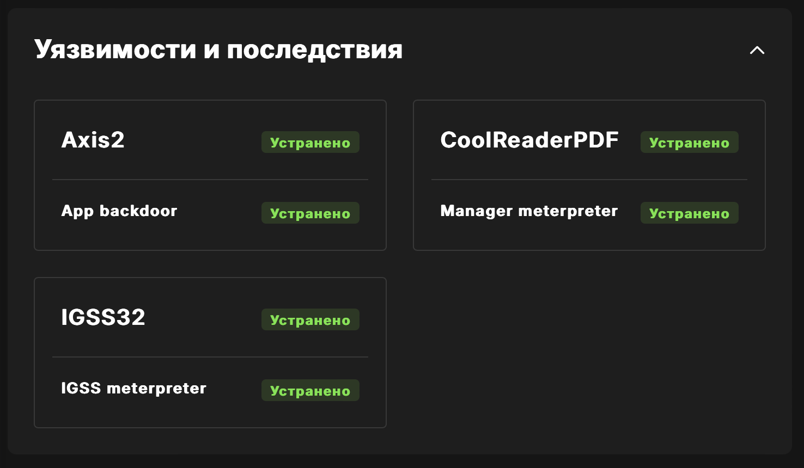{#fig:001 width=70%}

**Уязвимость 1.** Уязвимая версия axis2 (CVE-2010-0219)

**Последствие.**  App Backdoor

**Уязвимость 2.** Уязвимая версия программы CoolReaderPDF (CVE-2012-4914)

**Последствие.**  Manager meterpreter-сессия

**Уязвимость 2.** Уязвимая версия IGSS (CVE-2011-1567)

**Последствие.**  IGSS meterpreter-сессия
 
## Уязвимая версия axis2

Уязвимая версия axis2 установлена на AppServer под управлением
Apache Tomcat. В типовом шаблоне информационной системы используется
для развертывания веб-сервисов, работает через порт 8080.

**Эксплуатируемая уязвимость** – CVE-2010-0219. Компонент Axis2 SAP
BusinessObjects содержит учетную запись и пароль администратора по
умолчанию.

Из конфигурационного файла axis2.xml можно получить данные
учетной записи администратора, авторизоваться и загрузить вредоносный
сервис для исполнения команды

### Описание инцидента

С помощью AMTIP нашли правило обнаружения вторжений. Для (CVE-2010-0219) нашли необходимое правило (рис. [-@fig:002]).

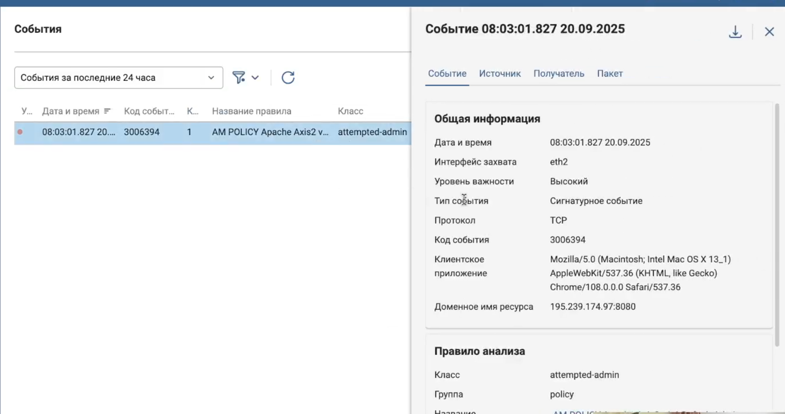{#fig:002 width=70%}
 
Далее перешли к заполнению инцидента (рис. [-@fig:003]).

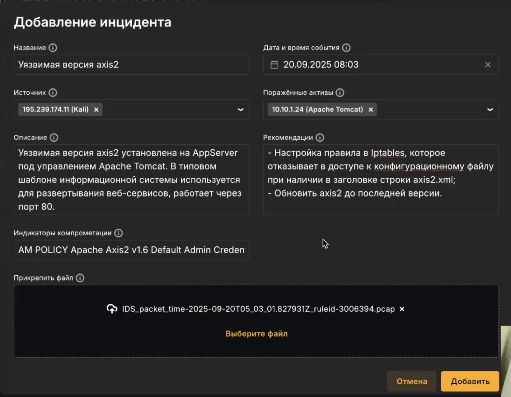{#fig:003 width=70%}

### Решение

Открываем KeePass. Находим Apache Tomcat и подключаемся к нему по ssh via Putty (рис. [-@fig:004]).

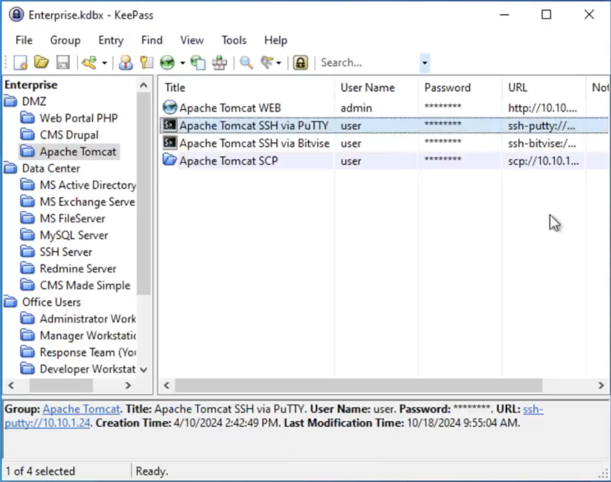{#fig:004 width=70%}

1. Настройка правил в Iptables. В утилите iptables добавить правило (iptables -I INPUT 1 -j REJECT -p tcp --dport 8080 -m string --string "axis2.xml" --algo kmp), которое отказывает в доступе к конфигурационному файлу при наличии в заголовке строки axis2.xml (рис. [-@fig:005]).

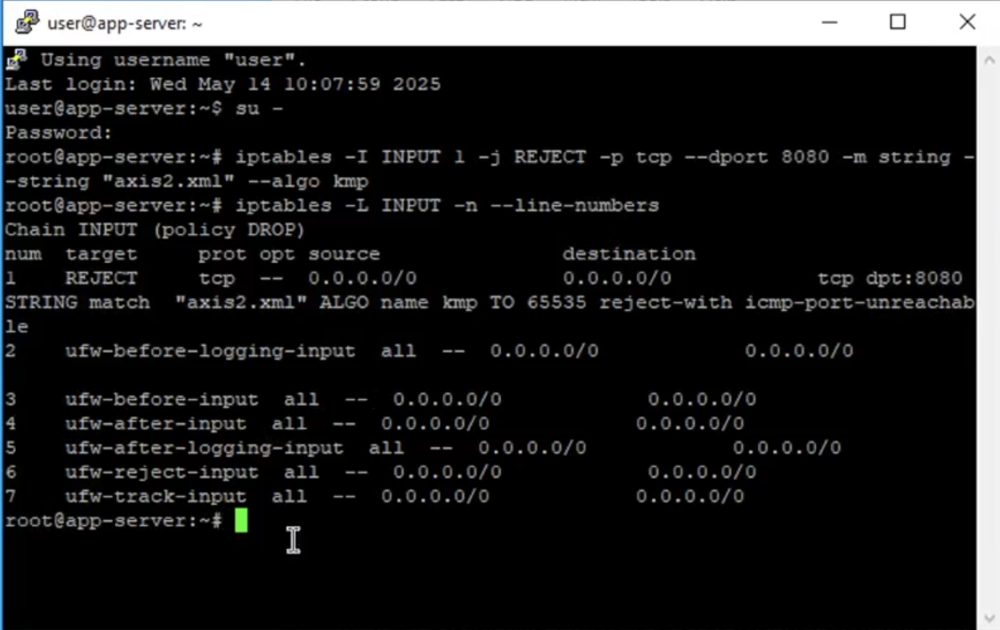{#fig:005 width=70%}

2. Обновить axis2 до последней версии. Войти на Tomcat сервер (в адресной строке браузера набрать http://10.10.1.24:8080). Нажать на кнопку Manager App (рис. [-@fig:006]).

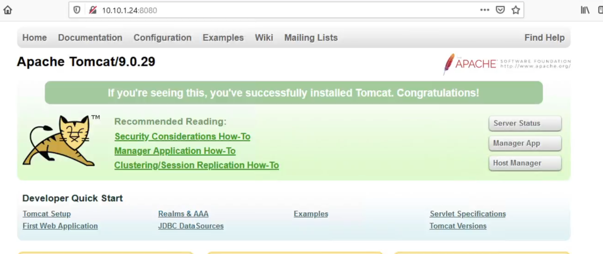{#fig:006 width=70%}

Войти под учетной записью администратора (admin / qwe1231@#). В таблице Applications найти строку с записью axis2 и нажать на кнопку Undeploy.Загрузить WAR файл axis2 актуальной версии. В поле WAR file to deploy нажать на Choose file, далее выбрать загруженный файл и нажать на кнопку Deploy
(рис. [-@fig:007])(рис. [-@fig:008]).

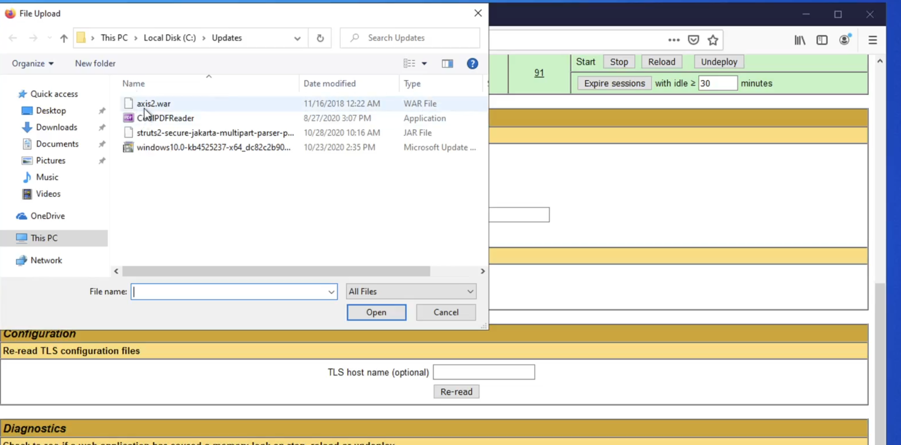{#fig:007 width=70%}

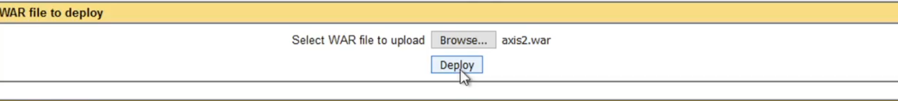{#fig:008 width=70%}

Деактивировать уязвимую версию axis2. В таблице Applications найти строку с записью axis2 и нажать на кнопку Stop.После остановки приложения axis2 остается в таблице, уязвимость будет успешно устранена.

### Последствия App Backdoor

Нарушитель для закрепления на уязвимой машине загружает файл, исполнение которого устанавливает Reverse Shell соединение с машиной нарушителя. Установленную сессию веб-сервера с IP-адресом нарушителя (195.239.174.11) и имя запущенного процесса можно обнаружить при помощи команды «sudo ss -tp» (рис. [-@fig:009]).

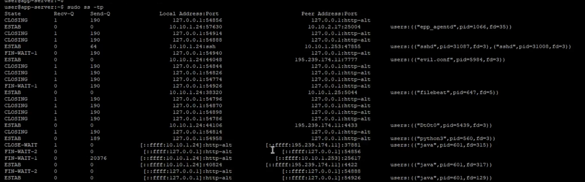{#fig:009 width=70%}

Событие автозапуска backdoor файла наблюдается в журнале /var/log/syslog (рис. [-@fig:010]).

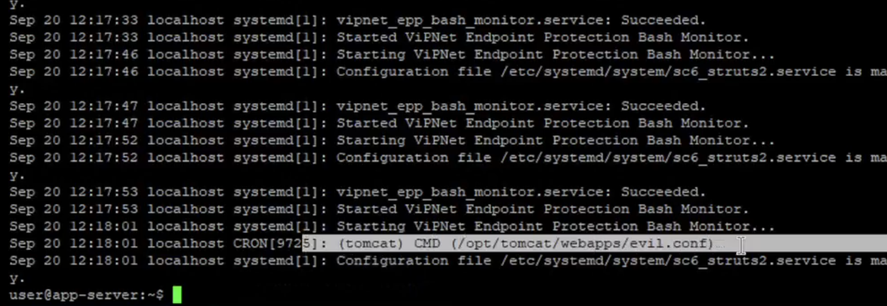{#fig:010 width=70%}

Последовательность действий для закрытия данной полезной нагрузки:

- убрать автозапуск исполняемого файла из стопtab пользователя
tomcat по пути /var/spool/cron/стопtabs/tomcat (рис. [-@fig:011]);

- удалить исполняемый файл evil.conf по пути /opt/tomcat/webapps/
с помощью команды rm evil.conf;

- завершить все активные сессии с машиной нарушителя с помощью
команды kill <pid>  (рис. [-@fig:012]).

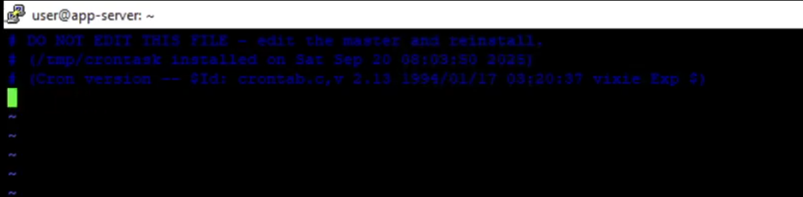{#fig:011 width=70%}

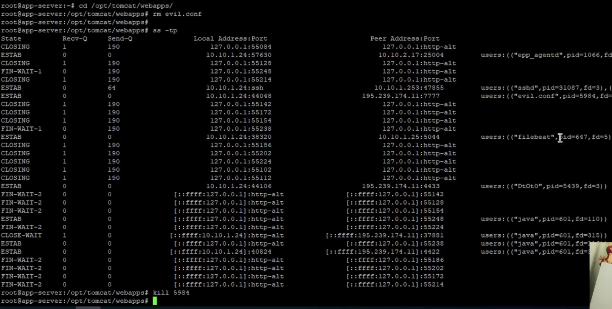{#fig:012 width=70%}

В результате проведенных действий нейтрализовано последствие,
которое обусловлено атакой нарушителя.

## Уязвимая версия программы CoolReaderPDF

На хосте Manager Workstation 1 установлена уязвимая версия программы
CoolReaderPDF. Хост используется для приема писем по публичной и
корпоративной электронной почте.
Эксплуатируемая уязвимость – CVE-2012-4914.

Переполнение стека в программе CoolPDFReader позволяет удаленно выполнять код при чтении специально сгенерированного документа. В данном случае сгенерированный документ соединен с некоторым стандартным отчетом. При просмотре последней страницы происходит эксплуатация уязвимости. Уязвимости подвержена программа чтения CoolReaderPDF версии 3.0.2.256, которая позволяет удаленным нарушителям выполнять произвольный код через документ PDF с созданным потоком
При просмотре начальной части документа программа работает стандартно. При попытке просмотра седьмой страницы программа не реагирует на команды пользователя («зависает»), нарушитель получает сессию.

### Описание инцидента

С помощью AMTIP нашли правило обнаружения вторжений. Для (CVE-2012-4914) не нашли необходимое правило, но для определения времени инцидента было выбрано правило ET TROJAN (рис. [-@fig:013]).

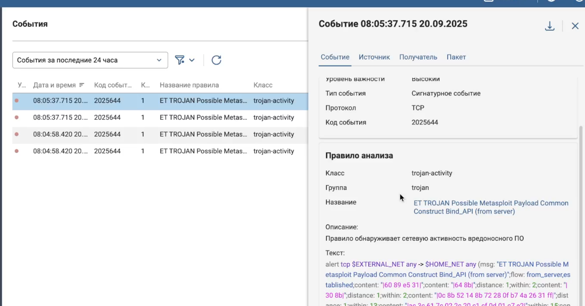{#fig:013 width=70%}
 
Далее перешли к заполнению инцидента (рис. [-@fig:014]).

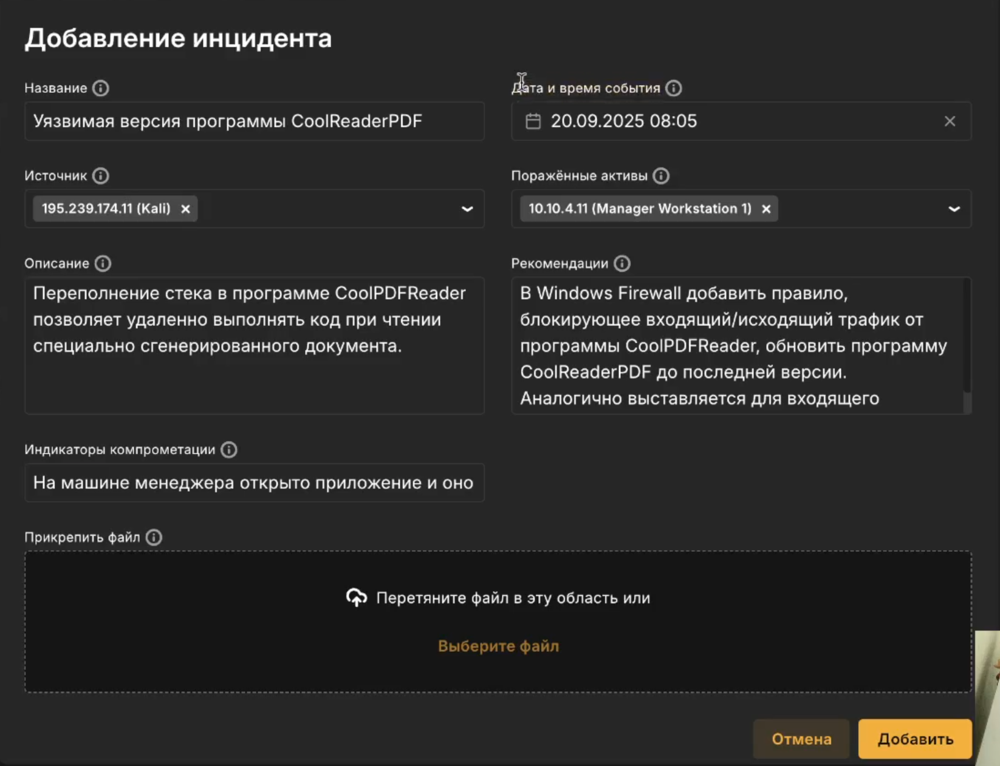{#fig:014 width=70%}

### Решение

Открываем KeePass. Находим Manager Workstation 1 и подключаемся по rdp от админа (рис. [-@fig:017]).

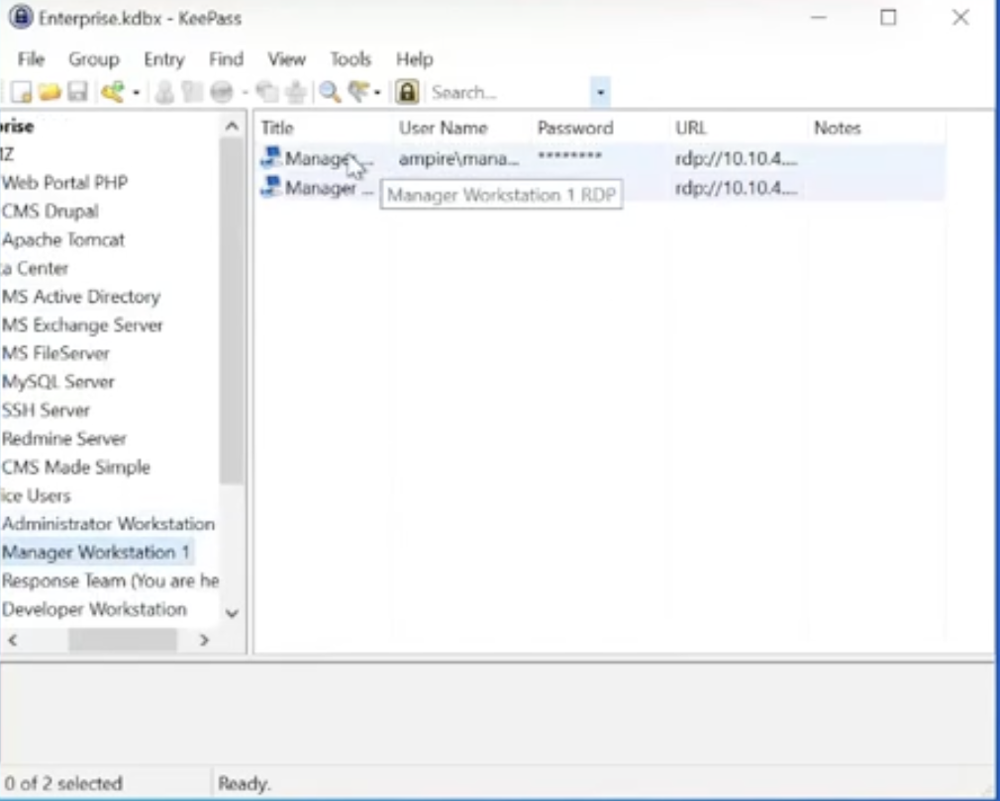{#fig:017 width=70%}

Встретили ошибку (рис. [-@fig:018]).

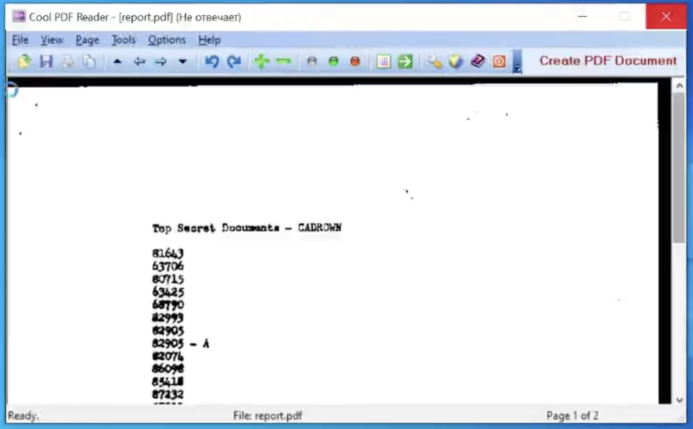{#fig:018 width=70%}

Открываем Windows Firewall with Advanced Security и добавляем правило для входящих подключений и исходящих подключений (рис. [-@fig:019])(рис. [-@fig:020]).

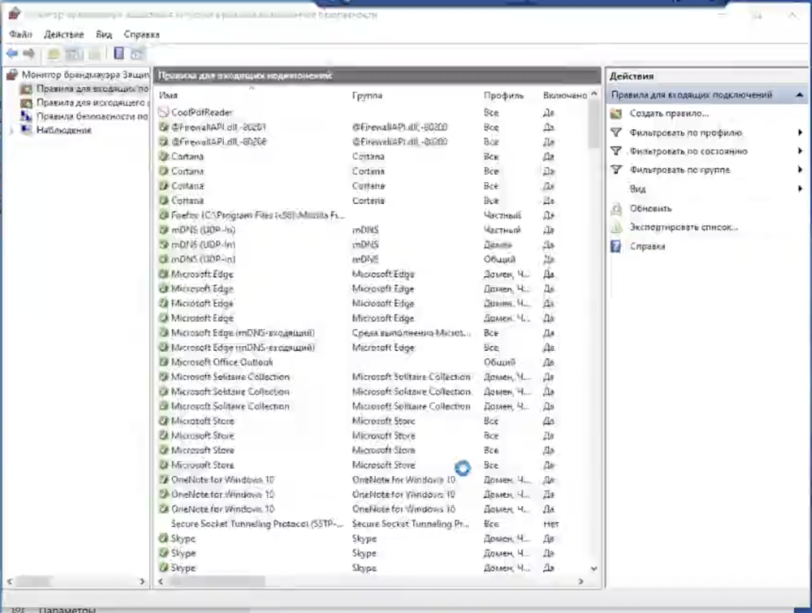{#fig:019 width=70%}

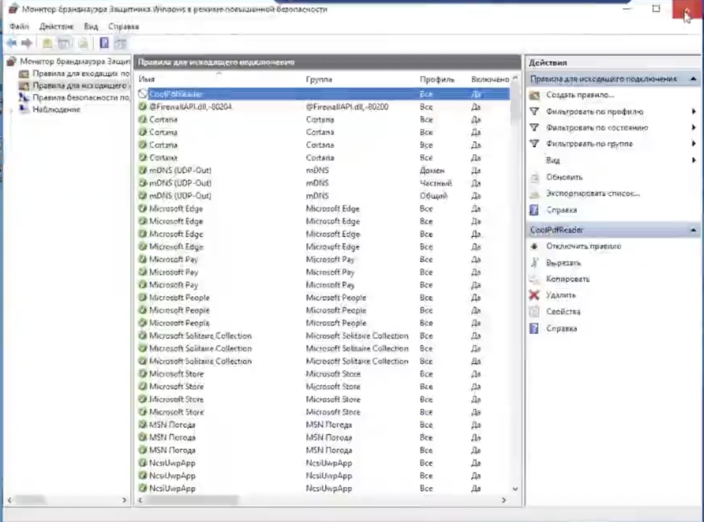{#fig:020 width=70%}

### Последствия Manager meterpreter

Вследствие переполнения стека нарушитель устанавливает reverse_shell

соединение с хостом Manager 1. Установленную сессию узла

Manager Workstation 1 с IP-адресом нарушителя (195.239.174.11) и имя

запущенного процесса можно обнаружить при помощи утилиты netstat с

ключами –bno (рис. [-@fig:021]).

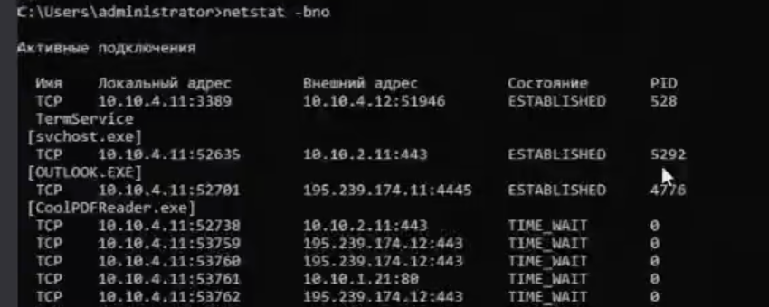{#fig:021 width=70%}

Для устранения полезной нагрузки необходимо завершить соединение с машиной нарушителя с помощью команды taskkill /f /pid <PID> (рис. [-@fig:022]).

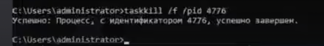{#fig:022 width=70%}

## Уязвимая версия IGSS

Эксплуатируемая уязвимость – CVE-2011-1567.

Переполнение стека в программе с графическим интерфейсом IGSSdataServer.exe при использовании операции ListAll ведет к удаленному выполнению кода и прямому подключению нарушителя к серверу. 

### Описание инцидента

С помощью AMTIP нашли правило обнаружения вторжений. Для Эксплуатируемая уязвимость – (CVE-2011-1567) нашли необходимое правило (рис. [-@fig:015]).

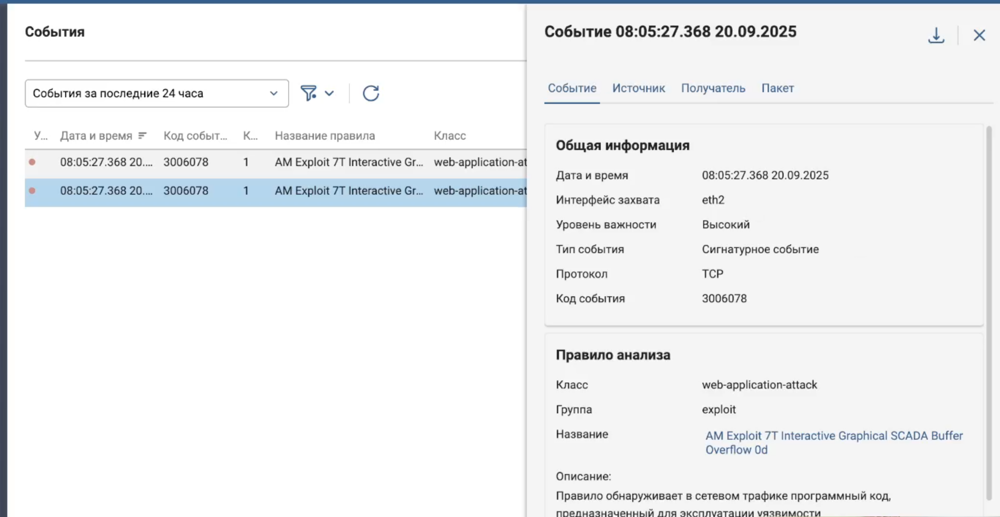{#fig:015 width=70%}
 
Далее перешли к заполнению инцидента (рис. [-@fig:016]).

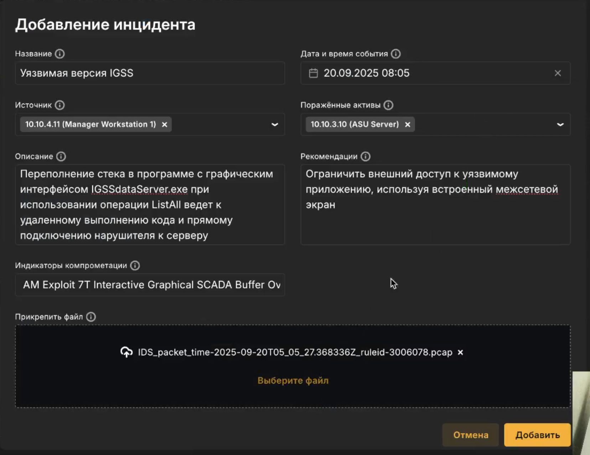{#fig:016 width=70%}

### Решение

Открываем KeePass. Находим SCADA IGSS и подключаемся по rdp (рис. [-@fig:023]).

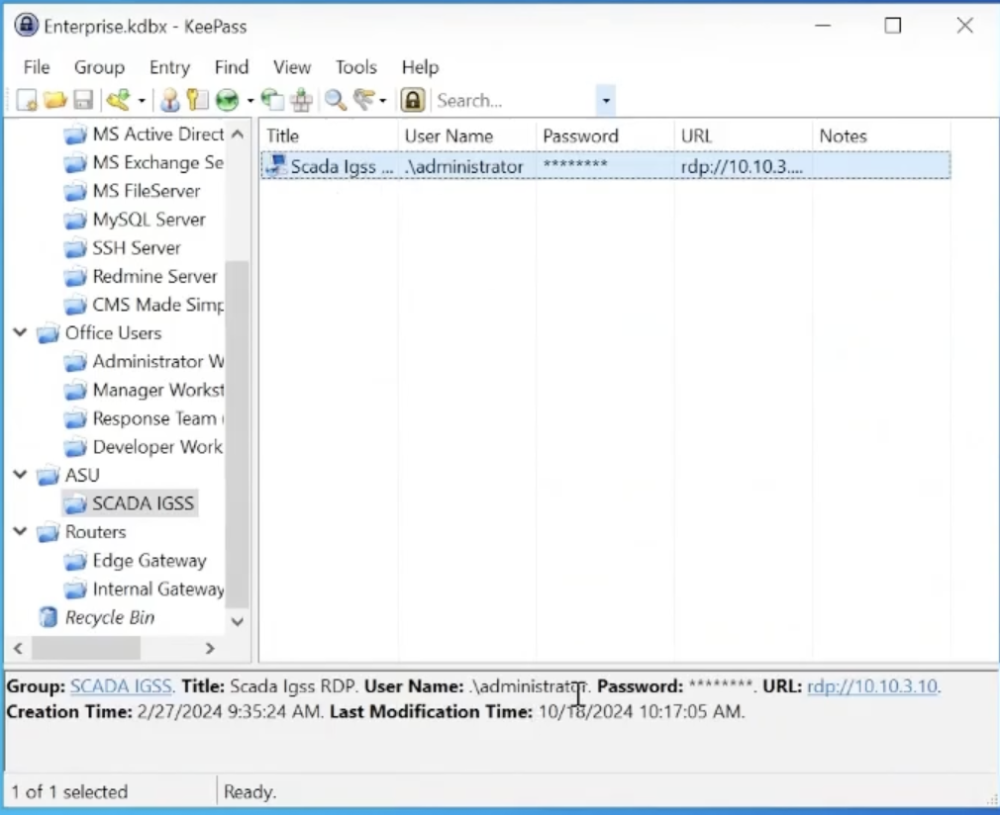{#fig:023 width=70%}

Включить брандмауэр Windows, выделить пункт «Не разрешать исключения» или убрать из исключений IGSS DataServer (рис. [-@fig:024]) (рис. [-@fig:025]).

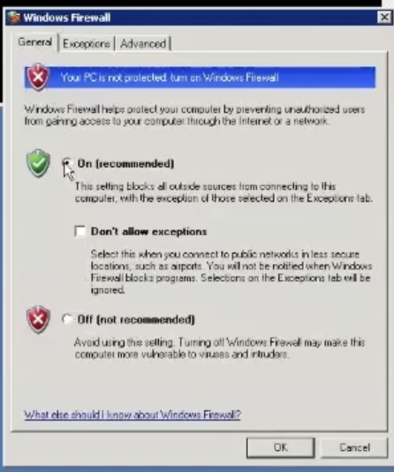{#fig:024 width=70%}

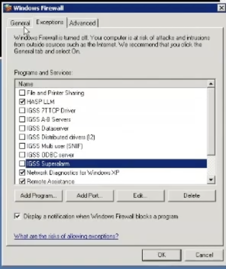{#fig:025 width=70%}

### Последствия IGSS meterpreter

Вследствие переполнения стека нарушитель устанавливает reverse_shell соединение с узлом SCADA Server. Установленную сессию с IP-адресом нарушителя (195.239.174.11) и запущенный процесс можно обнаружить при помощи утилиты netstat с ключами –bno (рис. [-@fig:026]).

{#fig:026 width=70%}

Для устранения полезной нагрузки необходимо завершить соединение с машиной нарушителя с помощью команды taskkill /f /pid <PID> (рис. [-@fig:027]).

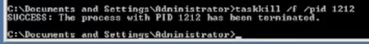{#fig:027 width=70%}

В результате выполнения команда запущенный процесс завершен, последствие IGSS meterpreter успешно устранено.

# Вывод

Разобрались с сценарием действий нарушителя "Защита данных сегмента АСУ ТП". Выявили и устранили уязвимости и их последствия (рис. [-@fig:029])

{#fig:029 width=70%}

# Список литературы {.unnumbered}

::: {#refs}
:::

