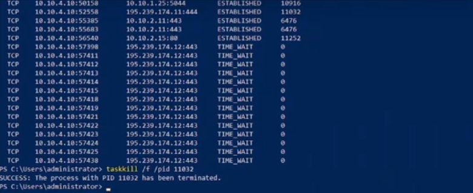

---
## Front matter
lang: ru-RU
title: Лабораторная работа 2-А
subtitle: Кибербезопасность предприятия
author:
- Ищенко Ирина 
- Мишина Анастасия 
- Дикач Анна 
- Галацан Николай 
- Амуничников Антон 
- Барсегян Вардан 
- Дудырев Глеб 
- Дымченко Дмитрий
institute:
  - Российский университет дружбы народов, Москва, Россия
date: 

## i18n babel
babel-lang: russian
babel-otherlangs: english

## Formatting pdf
toc: false
toc-title: Содержание
slide_level: 2
aspectratio: 169
section-titles: true
theme: metropolis
header-includes:
 - \metroset{progressbar=frametitle,sectionpage=progressbar,numbering=fraction}
---

##  Наша команда

  * НПИбд-01-22 
  * Российский университет дружбы народов

## Цель тренировки

Разобраться с сценарием действий нарушителя "Защита контроллера домена предприятия". Выявить и устранить уязвимости и их последствия.

## Выявленные уязвимости и последствия

## SQL-инъекция

На узле Web Server PHP находится уязвимый веб-сервис на порту 80. Нарушитель использует уязвимый параметр id в GET-запросе для загрузки и выполнения php reverse shell.

## Описание инцидента

## Решение

Находим место кода, где $id считывается из GET запроса

Считываем параметр сайта в функции actionView() в файле NewsController.php

Используем функцию is_numeric для проверки типа $id. Она возвращает True в случае, если $id  - число, иначе - False. В случае успешной проверки параметр будет передаваться в запрос, иначе - запрос будет статичным и независимым от $id. 

После внесения изменений в файл конфигурации и проверки значения параметра $id уязвимость SQL-инъекции успешно устранена.

## Решение

## Последствия Web portal meterpreter

Нарушитель устанавливает shell сессию с веб-порталом PHP. Для обнаружения последствия проверяем сокеты уязвимой машины при помощи утилиты ss  с ключами -tp.

## Последствия Web portal meterpreter

## Последствия Web portal meterpreter

Обнаруживаем то что етсь активное соединение веб-портала с IP-адресом нарушителя. Для устранения пользуемся командой ss с правами привилегированного пользователя, используя ключ -K и соответствующий адрес, порт для завершения сессии с нарушителем: sudo ss -K dst **HACKER_IP** dport=**HACKER_PORT**. В результате выполнения команды сессия с нарушителем завершена.

## Последствия Web portal meterpreter

## Отключённая защита антивируса

На рабочей станции администратора отключена защита в реальном времени Windows Defender (параметр DisableAntiSpyware в реестре), что позволяет запустить вредоносный скрипт.

## Описание инцидента

## Решение

На узле Administrator Workstation вручную удаляем запись в реестре или через консоль с помощью команды.

## Решение

 Подтверждаем действие, далее в Windows Defender перезапускаем Virus & Threat Protection и включаем Real-time Protecton.

## Решение

После Удаления записи реестра и включения защиты антивирусной программы перезапускаем Windows.

## Последствия Admin meterpreter

Установленную сессию с нарушителем находим при помощи утилиты netstat с ключами -ano

Для устранения завершаем сессию с машиной нарушителя. 

## Слабый пароль учётной записи

На узле MS Active Directory установлен слабый пароль учетной записи администратора, что позволяет нарушителю успешно подобрать его брутфорс-атакой (RDP Bruteforce). В журнале безопасности Windows событие с ID 1149 указывает на успешную аутентификацию. 

## Описание инцидента

  

## Решение

Изменяем пароль к учётной записи администратора на более сложный, не содержащийся в словарях.

## Последствие AD User

Находим нового привилегированного пользователя с помощью аудита событий входа в учётную запись Windows security, где появилось событие с ID 4720. Переходим в Evevnt Viewer и в Windows Logs - Secuirity, затем применяем фильтр на логи. 

### Последствие AD User

Чтобы удалить пользователя заходим в Administrative Tools - Active Directory Users and computers. Затем во вкладке Users находим и удаояем нового привилегированного пользователя с именем "Hackes".

В результате выполенения вышеупомянутых действий привилегированный пользователь удалён и последствие успешно устранено

## Вывод

Разобрались с сценарием действий нарушителя "Защита контроллера домена предприятия". Выявили и устранили уязвимости и их последствия 

