---
## Front matter
title: "Лабораторная работа 2-А (09_10)"
subtitle: "Кибербезопасность предприятия"
author: 
- Ищенко Ирина 
- Мишина Анастасия 
- Дикач Анна 
- Галацан Николай 
- Амуничников Антон 
- Барсегян Вардан 
- Дудырев Глеб 
- Дымченко Дмитрий

## Generic otions
lang: ru-RU
toc-title: "Содержание"

## Bibliography
bibliography: bib/cite.bib
csl: pandoc/csl/gost-r-7-0-5-2008-numeric.csl

## Pdf output format
toc: true # Table of contents
toc-depth: 2
lof: true # List of figures
lot: true # List of tables
fontsize: 12pt
linestretch: 1.5
papersize: a4
documentclass: scrreprt
## I18n polyglossia
polyglossia-lang:
  name: russian
  options:
  - spelling=modern
  - babelshorthands=true
polyglossia-otherlangs:
  name: english
## I18n babel
babel-lang: russian
babel-otherlangs: english
## Fonts
mainfont: IBM Plex Serif
romanfont: IBM Plex Serif
sansfont: IBM Plex Sans
monofont: IBM Plex Mono
mathfont: STIX Two Math
mainfontoptions: Ligatures=Common,Ligatures=TeX,Scale=0.94
romanfontoptions: Ligatures=Common,Ligatures=TeX,Scale=0.94
sansfontoptions: Ligatures=Common,Ligatures=TeX,Scale=MatchLowercase,Scale=0.94
monofontoptions: Scale=MatchLowercase,Scale=0.94,FakeStretch=0.9
mathfontoptions:
## Biblatex
biblatex: true
biblio-style: "gost-numeric"
biblatexoptions:
  - parentracker=true
  - backend=biber
  - hyperref=auto
  - language=auto
  - autolang=other*
  - citestyle=gost-numeric
## Pandoc-crossref LaTeX customization
figureTitle: "Рис."
tableTitle: "Таблица"
listingTitle: "Листинг"
lofTitle: "Список иллюстраций"
lotTitle: "Список таблиц"
lolTitle: "Листинги"
## Misc options
indent: true
header-includes:
  - \usepackage{indentfirst}
  - \usepackage{float} # keep figures where there are in the text
  - \floatplacement{figure}{H} # keep figures where there are in the text
---

# Цель тренировки

Разобраться с сценарием действий нарушителя "Защита контроллера домена предприятия". Выявить и устранить уязвимости и их последствия.

# Выявленные уязвимости и последствия

По ходу выполнения тренировки были выявлены следующие уязвимости:

**Уязвимость 1.** SQL-инъекция

**Последствие.**  Web portal meterpreter

**Уязвимость 2.** Отключённая защита антивируса

**Последствие.**  Admin meterpreter

**Уязвимость 3.** Слабый пароль учётной записи

**Последствие.**  Добавление привилегированного пользователя

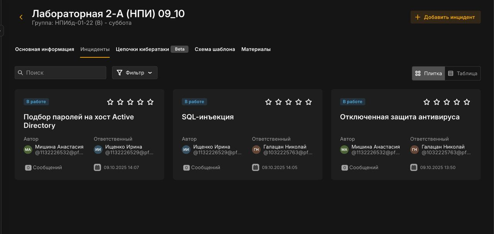
 
## SQL-инъекция

На узле Web Server PHP находится уязвимый веб-сервис на порту 80. Нарушитель использует уязвимый параметр id в GET-запросе для загрузки и выполнения php reverse shell.

### Описание инцидента

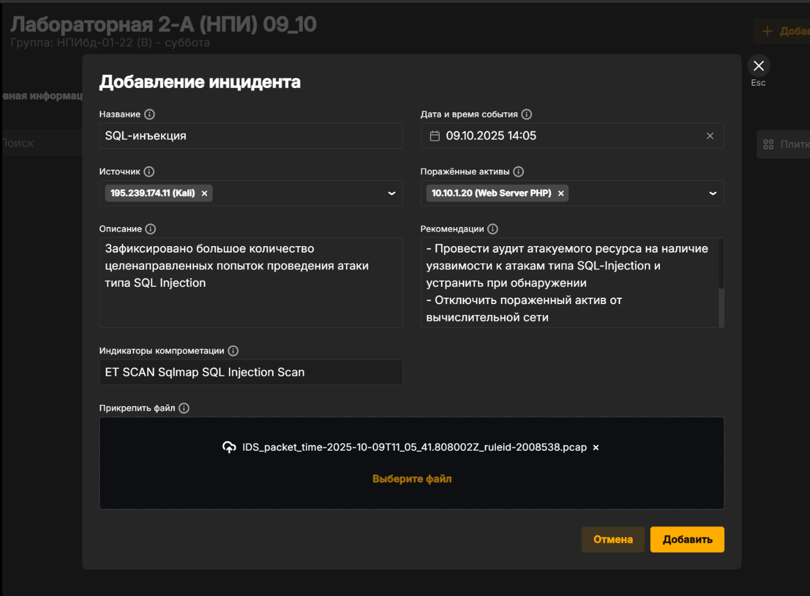

### Решение

Находим место кода, где $id считывается из GET запроса

Считываем параметр сайта в функции actionView() в файле NewsController.php

Используем функцию is_numeric для проверки типа $id. Она возвращает True в случае, если $id  - число, иначе - False. В случае успешной проверки параметр будет передаваться в запрос, иначе - запрос будет статичным и независимым от $id. 

После внесения изменений в файл конфигурации и проверки значения параметра $id уязвимость SQL-инъекции успешно устранена.

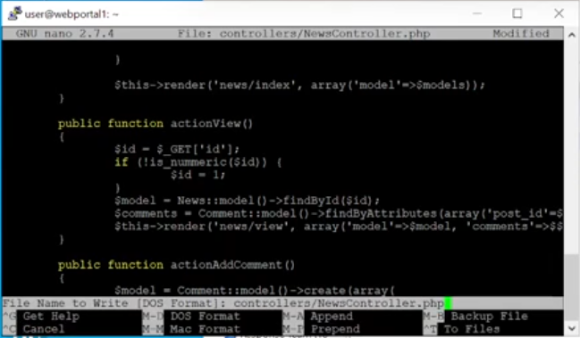

### Последствие Web portal meterpreter

Нарушитель устанавливает shell сессию с веб-порталом PHP. Для обнаружения последствия проверяем сокеты уязвимой машины при помощи утилиты ss  с ключами -tp.

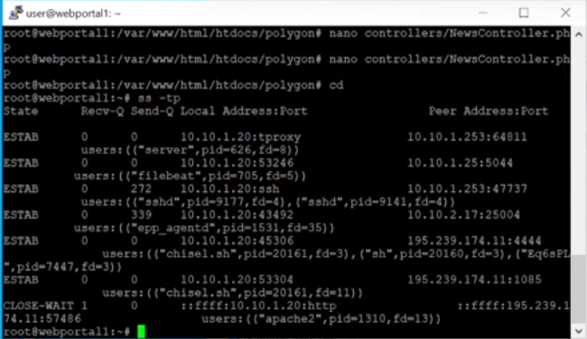

Обнаруживаем то что етсь активное соединение веб-портала с IP-адресом нарушителя. Для устранения пользуемся командой ss с правами привилегированного пользователя, используя ключ -K и соответствующий адрес, порт для завершения сессии с нарушителем: sudo ss -K dst **HACKER_IP** dport=**HACKER_PORT**. В результате выполнения команды сессия с нарушителем завершена.

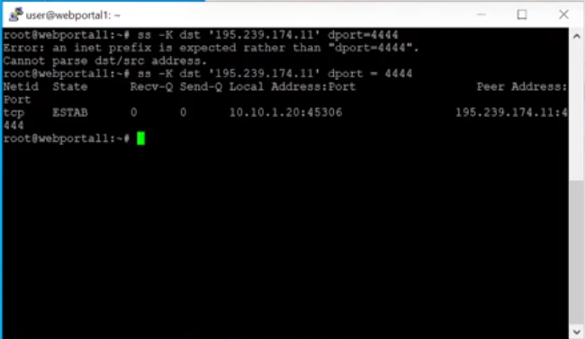

## Отключённая защита антивируса

На рабочей станции администратора отключена защита в реальном времени Windows Defender (параметр DisableAntiSpyware в реестре), что позволяет запустить вредоносный скрипт.

### Описание инцидента

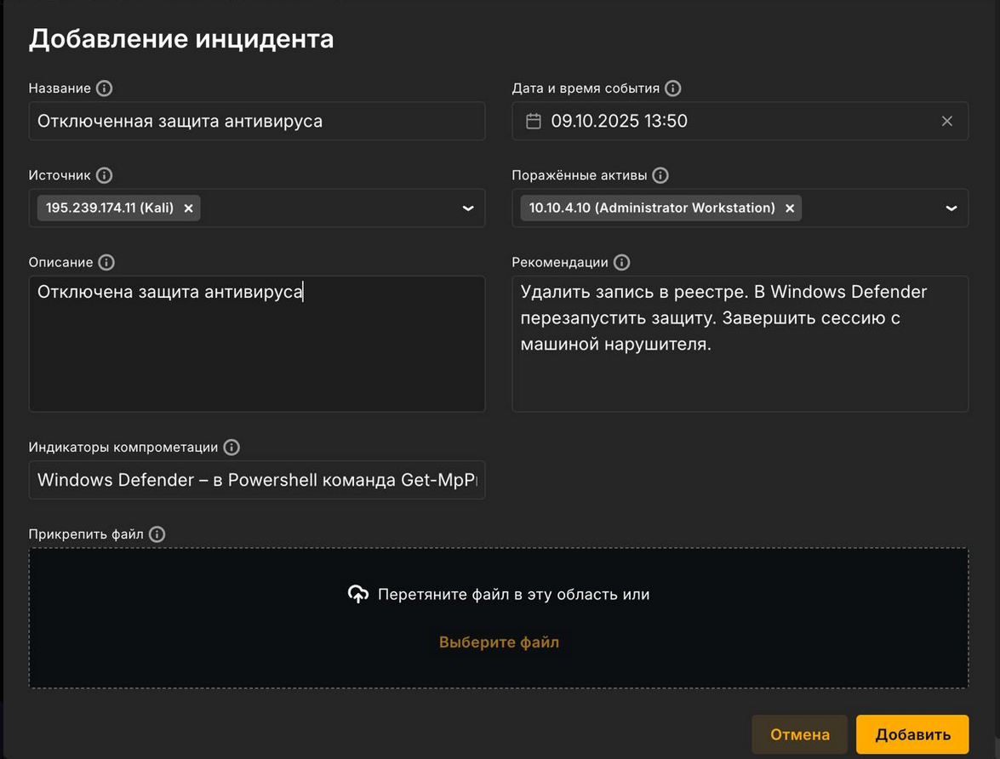

### Решение

На узле Administrator Workstation вручную удаляем запись в реестре или через консоль с помощью команды.

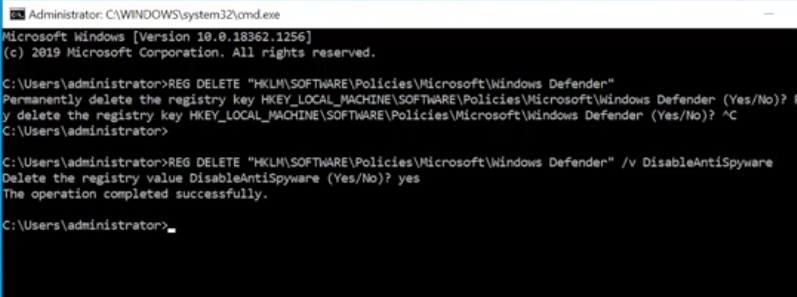

 Подтверждаем действие, далее в Windows Defender перезапускаем Virus & Threat Protection и включаем Real-time Protecton.

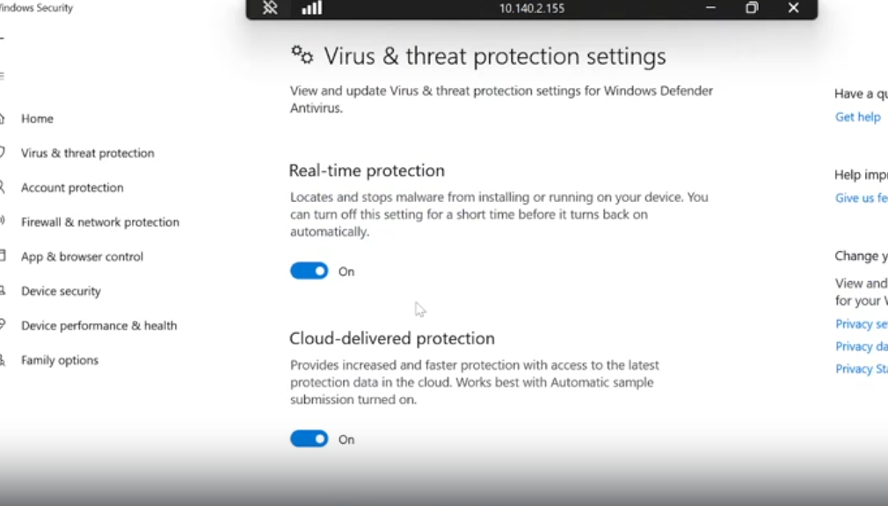

После Удаления записи реестра и включения защиты антивирусной программы перезапускаем Windows.

### Последствия Admin meterpreter

Установленную сессию с нарушителем находим при помощи утилиты netstat с ключами -ano

Для устранения завершаем сессию с машиной нарушителя. 

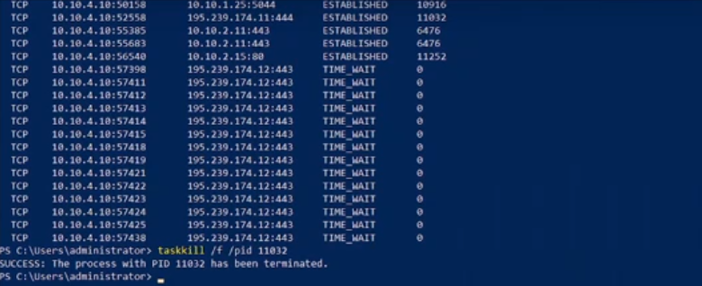

## Слабый пароль учётной записи

На узле MS Active Directory установлен слабый пароль учетной записи администратора, что позволяет нарушителю успешно подобрать его брутфорс-атакой (RDP Bruteforce). В журнале безопасности Windows событие с ID 1149 указывает на успешную аутентификацию. 

### Описание инцидента

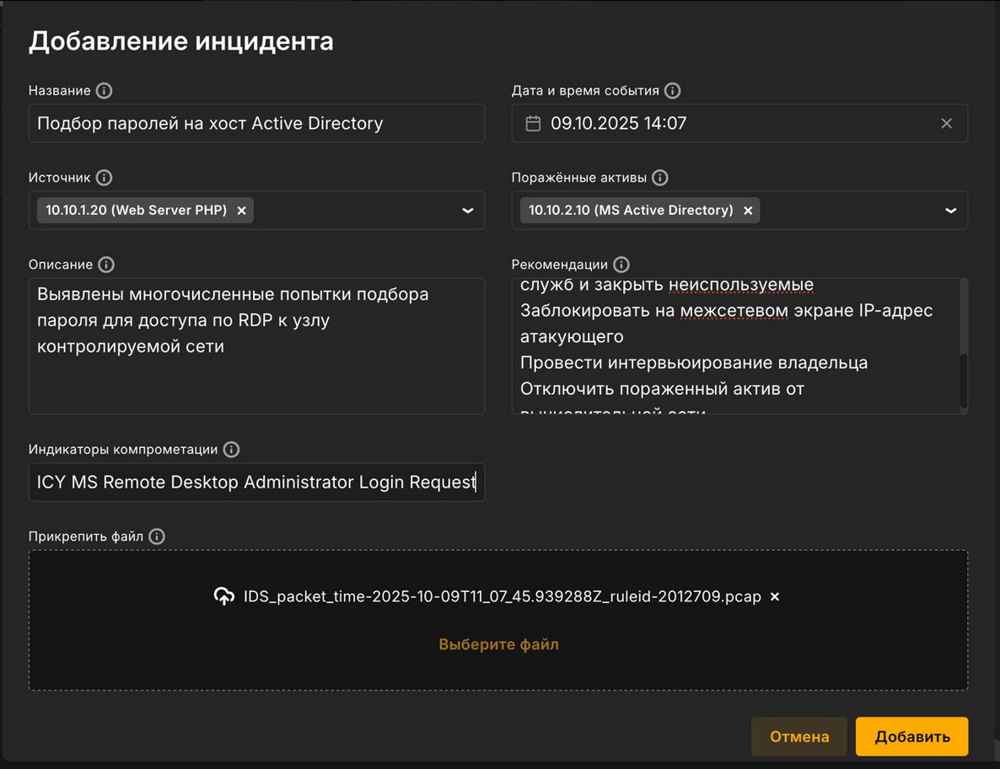

### Решение

Изменяем пароль к учётной записи администратора на более сложный, не содержащийся в словарях.

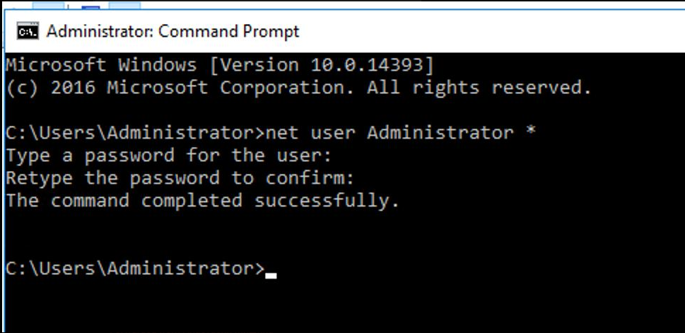

### Последствие AD User

Находим нового привилегированного пользователя с помощью аудита событий входа в учётную запись Windows security, где появилось событие с ID 4720. Переходим в Evevnt Viewer и в Windows Logs - Secuirity, затем применяем фильтр на логи. 

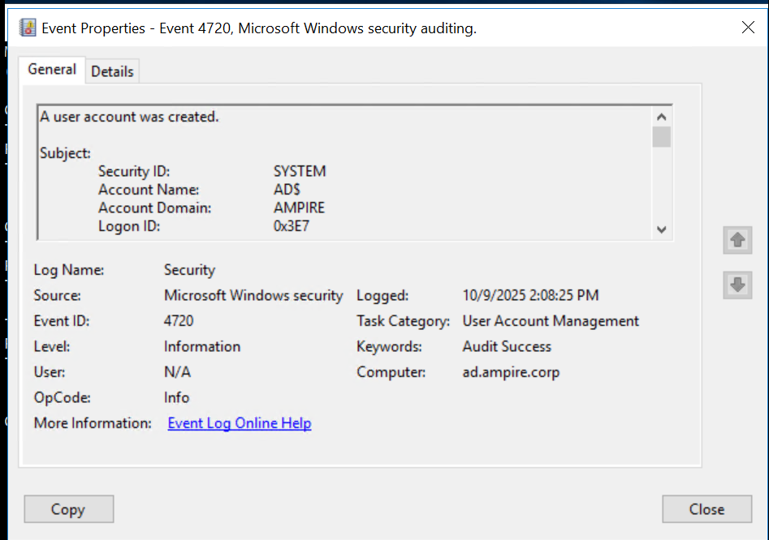

Чтобы удалить пользователя заходим в Administrative Tools - Active Directory Users and computers. Затем во вкладке Users находим и удаояем нового привилегированного пользователя с именем "Hackes".

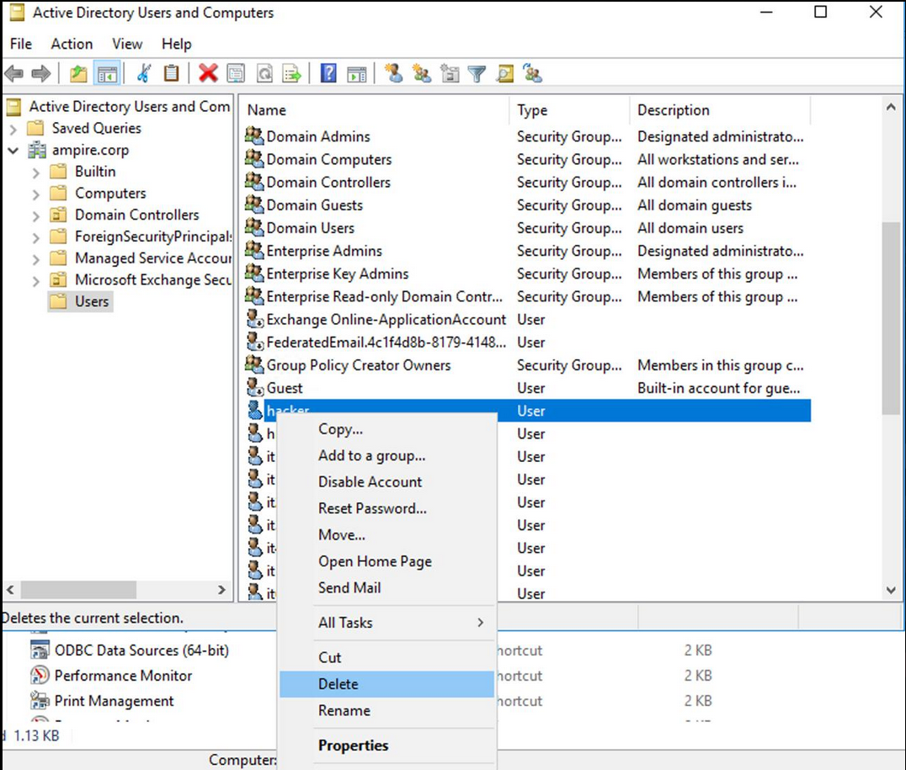

В результате выполенения вышеупомянутых действий привилегированный пользователь удалён и последствие успешно устранено. 

# Вывод

Разобрались с сценарием действий нарушителя "Защита контроллера домена предприятия". Выявили и устранили уязвимости и их последствия 

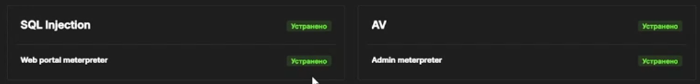
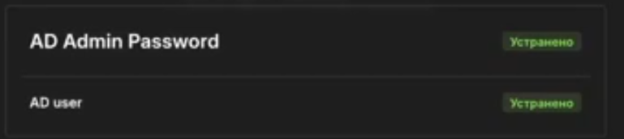

# Список литературы {.unnumbered}

::: {#refs}
:::

