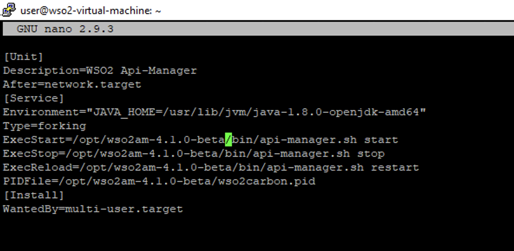

---
## Front matter
lang: ru-RU
title: Лабораторная работа 3-D
subtitle: Кибербезопасность предприятия
author:
- Ищенко Ирина 
- Мишина Анастасия 
- Дикач Анна 
- Галацан Николай 
- Амуничников Антон 
- Барсегян Вардан 
- Дудырев Глеб 
- Дымченко Дмитрий
institute:
  - Российский университет дружбы народов, Москва, Россия
date: 

## i18n babel
babel-lang: russian
babel-otherlangs: english

## Formatting pdf
toc: false
toc-title: Содержание
slide_level: 2
aspectratio: 169
section-titles: true
theme: metropolis
header-includes:
 - \metroset{progressbar=frametitle,sectionpage=progressbar,numbering=fraction}
---

##  Наша команда

  * НПИбд-01-22 
  * Российский университет дружбы народов

## Цель тренировки

Разобраться с сценарием действий нарушителя "Защита интеграционной платформы". Выявить и устранить уязвимости и их последствия.

## Выявленные уязвимости и последствия

По ходу выполнения тренировки были выявлены следующие уязвимости:

**Уязвимость 1.** Bitrix vote RCE

**Последствие.**  Deface

**Уязвимость 2.** GitLab RCE

**Последствие.**  meterpreter

**Уязвимость 3.** WSO2 API-Manager RCE

**Последствие.**  WSO2 User web
 
## Bitrix vote RCE

Эксплуатация уязвимости позволяет удаленному нарушителю записать произвольные файлы в систему с помощью отправки специально сформированных сетевых пакетов. Данная уязвимость присутствует в модуле vote CMS Bitrix до версии 22.0.400

## Обнаружение уязвимости

## Обнаружение уязвимости

## Описание инцидента

## Решение

## Решение

## Решение

## Решение

## Решение

## Решение

## Решение

## Решение

## Последствие Bitrix deface

## Последствие Bitrix deface

## Последствие Bitrix deface

## Последствие Bitrix deface

## GitLab RCE: Обнаружение уязвимости

## GitLab RCE: Обнаружение уязвимости

## Описание инцидента

## Решение

## Решение

## Решение

## Последствия meterpreter

## Последствия meterpreter

## WSO2 API-Manager RCE

Уязвимость платформы для интеграции интерфейсов прикладного программирования, приложений и веб-служб WSO2 связана с возможностью загрузки произвольного JSP-файла на сервер. Эксплуатация уязвимости может позволить нарушителю, действующему удаленно, выполнить произвольный код.

## Обнаружение уязвимости

## Обнаружение уязвимости

## Обнаружение уязвимости

## Обнаружение уязвимости

## Описание инцидента

## Решение

## Решение

## Решение

## Решение

## Решение

## Решение

### Последствие WSO2 User web

### Последствие WSO2 User web

# Вывод

Разобрались с сценарием действий нарушителя "Защита интеграционной платформы". Выявили и устранили уязвимости и их последствия.

