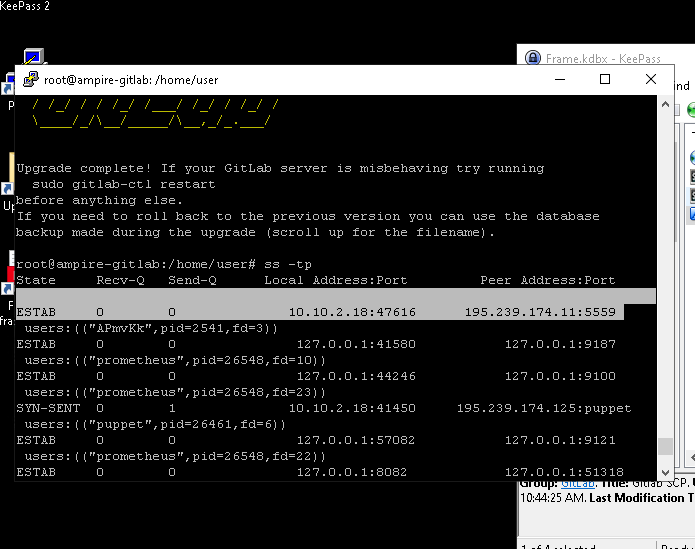
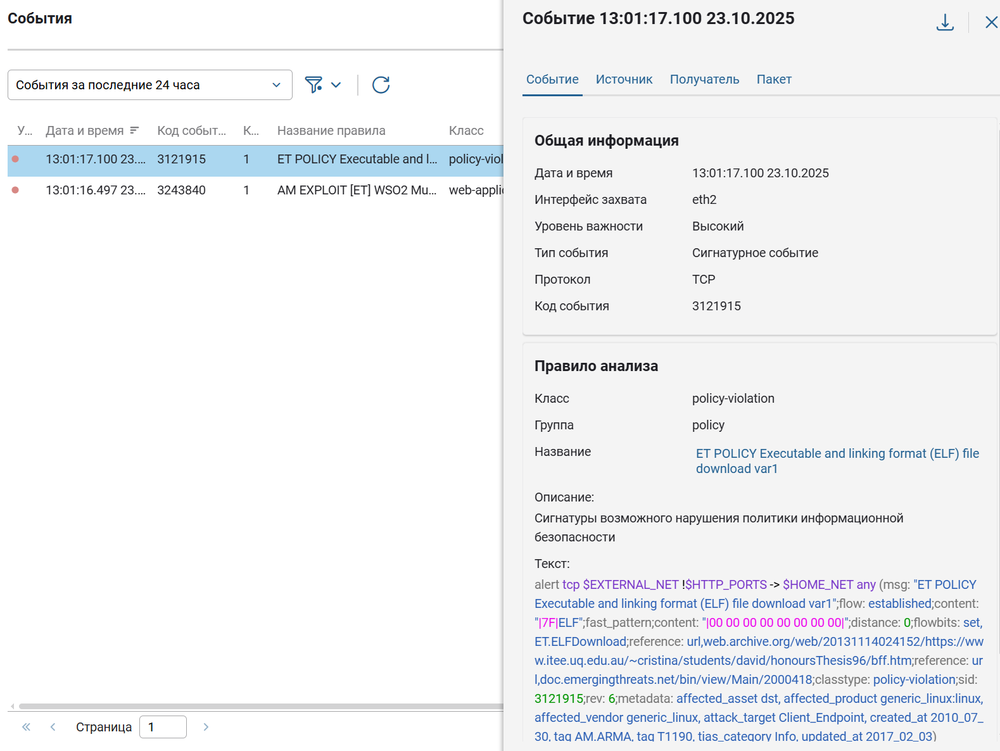

---
## Front matter
title: "Лабораторная работа 3-D"
subtitle: "Кибербезопасность предприятия"
author: 
- Ищенко Ирина 
- Мишина Анастасия 
- Дикач Анна 
- Галацан Николай 
- Амуничников Антон 
- Барсегян Вардан 
- Дудырев Глеб 
- Дымченко Дмитрий

## Generic otions
lang: ru-RU
toc-title: "Содержание"

## Bibliography
bibliography: bib/cite.bib
csl: pandoc/csl/gost-r-7-0-5-2008-numeric.csl

## Pdf output format
toc: true # Table of contents
toc-depth: 2
lof: true # List of figures
lot: true # List of tables
fontsize: 12pt
linestretch: 1.5
papersize: a4
documentclass: scrreprt
## I18n polyglossia
polyglossia-lang:
  name: russian
  options:
  - spelling=modern
  - babelshorthands=true
polyglossia-otherlangs:
  name: english
## I18n babel
babel-lang: russian
babel-otherlangs: english
## Fonts
mainfont: IBM Plex Serif
romanfont: IBM Plex Serif
sansfont: IBM Plex Sans
monofont: IBM Plex Mono
mathfont: STIX Two Math
mainfontoptions: Ligatures=Common,Ligatures=TeX,Scale=0.94
romanfontoptions: Ligatures=Common,Ligatures=TeX,Scale=0.94
sansfontoptions: Ligatures=Common,Ligatures=TeX,Scale=MatchLowercase,Scale=0.94
monofontoptions: Scale=MatchLowercase,Scale=0.94,FakeStretch=0.9
mathfontoptions:
## Biblatex
biblatex: true
biblio-style: "gost-numeric"
biblatexoptions:
  - parentracker=true
  - backend=biber
  - hyperref=auto
  - language=auto
  - autolang=other*
  - citestyle=gost-numeric
## Pandoc-crossref LaTeX customization
figureTitle: "Рис."
tableTitle: "Таблица"
listingTitle: "Листинг"
lofTitle: "Список иллюстраций"
lotTitle: "Список таблиц"
lolTitle: "Листинги"
## Misc options
indent: true
header-includes:
  - \usepackage{indentfirst}
  - \usepackage{float} # keep figures where there are in the text
  - \floatplacement{figure}{H} # keep figures where there are in the text
---

# Цель тренировки

Разобраться с сценарием действий нарушителя "Защита интеграционной платформы". Выявить и устранить уязвимости и их последствия.

# Выявленные уязвимости и последствия

По ходу выполнения тренировки были выявлены следующие уязвимости:

**Уязвимость 1.** Bitrix vote RCE

**Последствие.**  Deface

**Уязвимость 2.** GitLab RCE

**Последствие.**  meterpreter

**Уязвимость 3.** WSO2 API-Manager RCE

**Последствие.**  WSO2 User web
 
## Bitrix vote RCE

Эксплуатация уязвимости позволяет удаленному нарушителю записать произвольные файлы в систему с помощью отправки специально сформированных сетевых пакетов. Данная уязвимость присутствует в модуле vote CMS Bitrix до версии 22.0.400

### Обнаружение уязвимости

### Описание инцидента

### Решение

Проверяем логи доступа Apache2

Находим файл полезной нагрузки из директории веб-сервера, далее при просмотре содержимого данного файла находим информацию о скачивании backdoor

При помощи сканера находим уязвимость - файл-backdoor для выполнения произвольных комант на уязвимой машине.

Просматриваем сокеты с машиной нарушителя, а также открываем содержимое директории веб-сервера, таким образом находим повышения привелегий.

В скомпилированом файле apache_restart содержится относительный вызов системной программы systemctl, через которую устанавливается соединение с машиной нарушителя

Исполняемый файл systemctl устанавливающий соединение с нарушителем

Закрываем LPE путем удаления файла apache_restart

Для устранения CVE-2022-27228, изменяем файл uf.php

### Последствие Bitrix deface

Данная полезная нагрузка нацелена на подрыв репутации компании
путем изменения главной страницы сайта. Полезная нагрузка меняет пароль
от учетной записи администратора, в связи с чем невозможно получить доступ
к панели администрирования

В директории веб сервера находим скрипт password_recovery

Данный скрипт подменяет пароль, поэтому необходимо изменить подменяемый пароль, затем зайти в администрирование сайти.

Удаляем скрипт, который подменял пароль

Разархивируем резервную копию веб-сервера, предварительно удалив файлы веб-сервера после использования полезной нагрузки

## GitLab RCE

На рабочей станции администратора отключена защита в реальном времени Windows Defender (параметр DisableAntiSpyware в реестре), что позволяет запустить вредоносный скрипт.

## Обнаружение уязвимости

### Описание инцидента

### Решение

Находим файл с версией Gitlab, где устранена уязвимость.

После подключения к серверу Gitlab по протоколу SSH необходимо получить привилегии sudo-пользователя.
Для обновления до версии 13.10.3 следует перейти в папку нахождения файла обновления и выполнить команду.
С помощью команды dpkg будет установлен файл обновления *.DEB.

Обновление успешно установлено.

### Последствия meterpreter

Для прерывания соединения с машиной нарушителя необходимо принудительно остановить процесс с помощью команды kill вместе с номером процесса.

Последствие устранено.

## WSO2 API-Manager RCE

Уязвимость платформы для интеграции интерфейсов прикладного программирования, приложений и веб-служб WSO2 связана с возможностью загрузки произвольного JSP-файла на сервер. Эксплуатация уязвимости может позволить нарушителю, действующему удаленно, выполнить произвольный код.

### Обнаружение уязвимости

### Описание инцидента

### Решение

Обновление версии API-Manager до версии 4.1.0 Beta Released.

Данная уязвимость исправлена разработчиками в версиях 4.1.0 и выше. Для закрытия уязвимости необходимо обновить версию, удалить файлы, загруженные во время атаки:

1. остановить запущенную службу уязвимого приложения с помощью команды systemctl stop wso2api-service;

2. перейти по ссылке https://github.com/wso2/product-apim/releases/download/v4.1.0-beta/wso2am-4.1.0-beta.zip и загрузить обновленную версию WSO2 API-Manager 4.1.0-Beta Released

3. распаковать загруженный архив с помощью команды sudo unzip wso2am-4.1.0-beta.zip –d /opt, изменить службу автозапуска приложения, указать путь до актуальной версии программы в конфигурационном файле службы по пути /etc/system/system/wso2api.service 

4. Далее необходимо перезагрузить процесс systemd с помощью команды: sudo systemctl daemon-reload. Перезапустить службу WSO2 sudo systemctl restart wso2api.service, далее просмотреть статус запущенной службы и путь до исполняемого файла с помощью команды: sudo systemctl status wso2api.service.

5. Также необходимо удалить загруженный exploit.jsp файл по пути /opt/wso2am-4.0.0/repository/deployment/server/webapps/authentic ationendpoint c помощью команды: rm exploit.jsp.

Далее удалить сгенерированный файл payload.elf в директории /tmp c помощью команды rm payload.elf.

### Последствие WSO2 User web

Данная полезная нагрузка заключается создании нарушителем пользователя в веб-интерфейсе WSO2 API-Manager. Для обнаружения полезной нагрузки достаточно зайти в веб-интерфейс WSO2 API-Manager по ссылке https://10.10.2.27:9443/carbon и просмотреть список существующих пользователей. Создание пользователя можно отследить и через журнал событий,
расположенного по пути /var/log/wso2_http_access.log.

Для нейтрализации данной полезной нагрузки необходимо удалить созданного пользователя в веб-интерфейсе.

# Вывод

Разобрались с сценарием действий нарушителя "Защита интеграционной платформы". Выявили и устранили уязвимости и их последствия.

