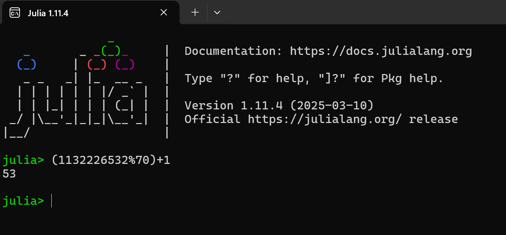
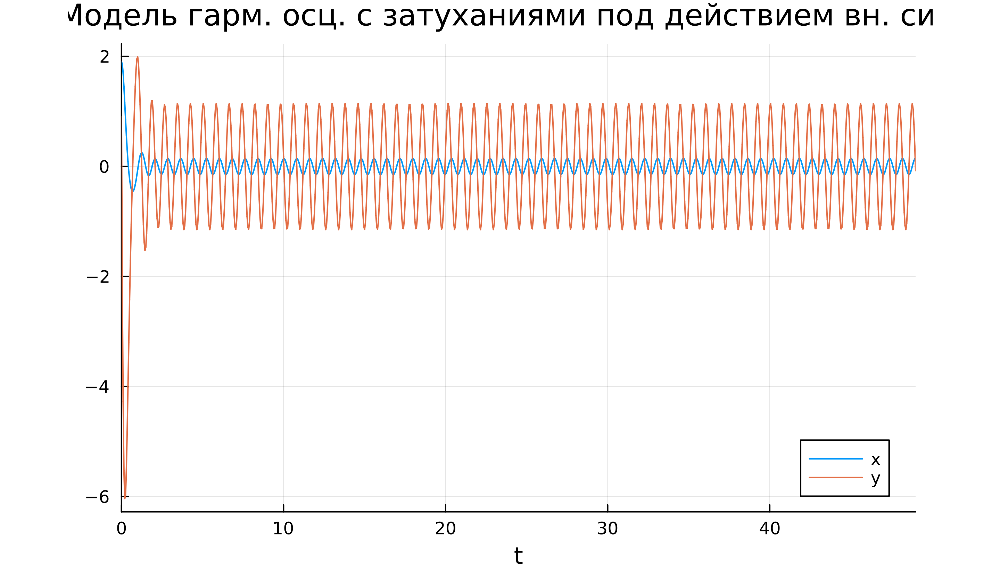

---
## Front matter
lang: ru-RU
title: Лабораторная работа 4-А
subtitle: Кибербезопасность предприятия
author:
- Ищенко Ирина 
- Мишина Анастасия 
- Дикач Анна 
- Галацан Николай 
- Амуничников Антон 
- Барсегян Вардан 
- Дудырев Глеб 
- Дымченко Дмитрий
institute:
  - Российский университет дружбы народов, Москва, Россия
date: 

## i18n babel
babel-lang: russian
babel-otherlangs: english

## Formatting pdf
toc: false
toc-title: Содержание
slide_level: 2
aspectratio: 169
section-titles: true
theme: metropolis
header-includes:
 - \metroset{progressbar=frametitle,sectionpage=progressbar,numbering=fraction}
---

##  Наша команда

  * НПИбд-01-22 
  * Российский университет дружбы народов

## Цель тренировки

Получить доступ к флагу почтового сервера организации, расположенного на внешнем периметре.

## Способы получения флага

Флаг можно получить различными способами. Предварительно необходимо произвести
разведку инфраструктуры для обнаружения и дальнейшей эксплуатации уязвимостей.

1. Разведка на предмет поиска вектора атаки
2. Использование уязвимости ProxyShell
3. Эксплуатация уязвимости ProxyLogon

# Разведка на предмет поиска вектора атаки

## Сканирование хоста на открытые порты

Просканируем подсеть просканировать подсеть 195.239.174.0/24 на открытые порты.

## Проверка на наличие почтового сервера

На предыдущем шаги были найдены порты, которые указывают на наличие почтового сервера. В этом можно убедиться перейдя по адресу https://195.239.174.1

## Определение версии Exchange Server

С помощью режима разработчика определяем версию Server Exchange.

## CVEdetails

Для дальнейшего планирования вектора атаки будем использовать https://www.cvedetails.com.

## Список уязвимостей доступных к эксплуатации

С помощью специального фильтра получаем нужный список уязвимостей.

## Детальная информация об уязвимостях

При просмотре детальной информации об уязвимостях можно убедиться, что первая дата раскрытия информации больше даты выпуска сборки атакуемого почтового сервера, значит эти уязвимости можно использовать.

## Детальная информация CVE-2021-34473

## Детальная информация CVE-2021-26855

## Сканирование с помощью Metasploit

Для поиска возможных векторов атаки будем использовать модуль Metasploit

# Использование уязвимости ProxyShell

## Запуск эксплуатации ProxyShell

## Получение флага

# Эксплуатация уязвимости ProxyLogon

## Получение соединения с удаленным узлом

С использованием почты manager1@ampire.corp можно применить данный модуль для получения соединения с удаленным узлом

## Запуск эксплуатации ProxyLogon

Следующим шагом необходимо запустить эксплуатацию ProxyLogon. 

## Получения флага

После получения сессии с почтовым сервером можно найти флаг по пути в файле flag_for_red_team.txt

## Итоги

## Итоги

