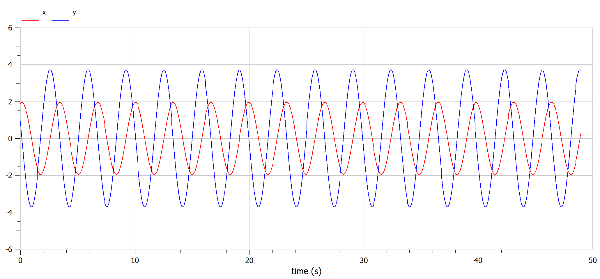

---
## Front matter
lang: ru-RU
title: Лабораторная работа №4
subtitle: Математическое моделирование
author:
  - Мишина А. А.
date: 1 апреля 2025

## i18n babel
babel-lang: russian
babel-otherlangs: english

## Formatting pdf
toc: false
toc-title: Содержание
slide_level: 2
aspectratio: 169
section-titles: true
theme: metropolis
header-includes:
 - \metroset{progressbar=frametitle,sectionpage=progressbar,numbering=fraction}
---

## Докладчик

:::::::::::::: {.columns align=center}
::: {.column width="70%"}

  * Мишина Анастасия Алексеевна
  * НПИбд-02-22
  * <https://github.com/nasmi32>

:::
::: {.column width="30%"}


:::
::::::::::::::

## Цели и задачи

- Построить математическую модель гармонического осциллятора.

## Задача

Использую формулу для определения варианта задания.

{#fig:1 width=70%}

## Задача

Построить фазовый портрет гармонического осциллятора и решение уравнения гармонического осциллятора для следующих случаев:

1. Колебания гармонического осциллятора без затуханий и без действий внешней силы
  $$\ddot{x} + 1.9x = 0 $$
2. Колебания гармонического осциллятора c затуханием и без действий внешней силы 
  $$\ddot x + 2.9 \dot x + 3.9 x = 0 $$
3. Колебания гармонического осциллятора c затуханием и под действием внешней силы 
   $$\ddot x + 4.9 \dot x + 5.9 x = 6.9 sin(7.9 t)$$
На интервале $t \in [0; 49]$ (шаг 0.05) с начальными условиями $x_0 = 1.9,  y_0=0.9$.

# Выполнение лабораторной работы

# Модель колебаний гармонического осциллятора без затуханий и без действий внешней силы

## Julia

```Julia
# Используемые библиотеки
using DifferentialEquations, Plots;
# Начальные условия
tspan = (0, 49)
u0 = [1.9, 0.9]
p1 = [0, 1.9]
# Задание функции
function f1(u, p, t)
	x, y = u
	g, w = p
	dx = y
	dy = -g .*y - w^2 .*x
	return [dx, dy]
end
```

## Julia

```Julia
# Постановка проблемы и ее решение
problem1 = ODEProblem(f1, u0, tspan, p1)
sol1 = solve(problem1, Tsit5(), saveat = 0.05)

plot(sol1, title = "Модель гармонического осциллятора без затуханий",
label = ["x" "y"], xaxis = "t")
plot(sol1, idxs=(1, 2), title = "Фазовый портрет",
label = "Зависимость х от у", xaxis = "x", yaxis = "y")
```

## Julia

{#fig:2 width=70%}

## Julia

{#fig:3 width=70%}

## OpenModelica

```
model lab4_1
  parameter Real g = 0;
  parameter Real w = 1.9;
  parameter Real x0 = 1.9;
  parameter Real y0 = 0.9;
  Real x(start=x0);
  Real y(start=y0);
equation
  der(x) = y;
  der(y) = -g .*y - w^2 .*x;
end lab4_1;
```

## OpenModelica

{#fig:4 width=70%}

## OpenModelica

{#fig:5 width=70%}

# Модель колебаний гармонического осциллятора с затуханиями и без действий внешней силы

## Julia

```Julia

# Начальные условия
p2 = [2.9, 3.9]

# Постановка проблемы и ее решение
problem2 = ODEProblem(f1, u0, tspan, p2)
sol2 = solve(problem2, Tsit5(), saveat = 0.05)
```

```Julia
plot(sol2, title = "Модель гармонического осциллятора с затуханиями",
label = ["x" "y"], xaxis = "t")
plot(sol2, idxs=(1, 2), title = "Фазовый портрет",
label = "Зависимость х от у", xaxis = "x", yaxis = "y")
```

## Julia

{#fig:6 width=70%}

## Julia

{#fig:7 width=70%}

## OpenModelica

```
model lab4_2
  parameter Real g = 2.9;
  parameter Real w = 3.9;
  parameter Real x0 = 1.9;
  parameter Real y0 = 0.9;
  Real x(start=x0);
  Real y(start=y0);
equation
  der(x) = y;
  der(y) = -g .*y - w^2 .*x;
end lab4_2;
```

## OpenModelica

{#fig:8 width=70%}

## OpenModelica

{#fig:9 width=70%}

# Модель колебаний гармонического осциллятора с затуханиями и под действием внешней силы

## Julia

```Julia
# Начальные условия
p3 = [4.9, 5.9]
# Функция, описывающая внешние силы, действующие на осциллятор
f(t) = 6.9*sin(7.9*t)
# Задание функции
function f2(u, p, t)
	x, y = u
	g, w = p
	dx = y
	dy = -g .*y - w^2 .*x .+f(t)
	return [dx, dy]
end
```

## Julia

```Julia
# Постановка проблемы и ее решение
problem3 = ODEProblem(f2, u0, tspan, p3)
sol3 = solve(problem3, Tsit5(), saveat = 0.05)

plot(sol3, title = "Модель гарм. осц. с затуханиями под действием вн. силы",
label = ["x" "y"], xaxis = "t")
plot(sol3, idxs=(1, 2), title = "Фазовый портрет",
label = "Зависимость х от у", xaxis = "x", yaxis = "y")
```

## Julia

{#fig:10 width=70%}

## Julia

{#fig:11 width=70%}

## OpenModelica

```
model lab4_3
  parameter Real g = 4.9;
  parameter Real w = 5.9;
  parameter Real x0 = 1.9;
  parameter Real y0 = 0.9;
  Real x(start=x0);
  Real y(start=y0);
equation
  der(x) = y;
  der(y) = -g .*y - w^2 .*x + 6.9*sin(7.9*time);
end lab4_3;
```

## OpenModelica

{#fig:12 width=70%}

## OpenModelica

{#fig:13 width=70%}

## Вывод

В ходе выполнения лабораторной работы я построила математическую модель гармонического осциллятора.

