---
## Front matter
title: "Лабораторная работа 4-А"
subtitle: "Кибербезопасность предприятия"
author: 
- Ищенко Ирина 
- Мишина Анастасия 
- Дикач Анна 
- Галацан Николай 
- Амуничников Антон 
- Барсегян Вардан 
- Дудырев Глеб 
- Дымченко Дмитрий

## Generic otions
lang: ru-RU
toc-title: "Содержание"

## Bibliography
bibliography: bib/cite.bib
csl: pandoc/csl/gost-r-7-0-5-2008-numeric.csl

## Pdf output format
toc: true # Table of contents
toc-depth: 2
lof: true # List of figures
lot: true # List of tables
fontsize: 12pt
linestretch: 1.5
papersize: a4
documentclass: scrreprt
## I18n polyglossia
polyglossia-lang:
  name: russian
  options:
  - spelling=modern
  - babelshorthands=true
polyglossia-otherlangs:
  name: english
## I18n babel
babel-lang: russian
babel-otherlangs: english
## Fonts
mainfont: IBM Plex Serif
romanfont: IBM Plex Serif
sansfont: IBM Plex Sans
monofont: IBM Plex Mono
mathfont: STIX Two Math
mainfontoptions: Ligatures=Common,Ligatures=TeX,Scale=0.94
romanfontoptions: Ligatures=Common,Ligatures=TeX,Scale=0.94
sansfontoptions: Ligatures=Common,Ligatures=TeX,Scale=MatchLowercase,Scale=0.94
monofontoptions: Scale=MatchLowercase,Scale=0.94,FakeStretch=0.9
mathfontoptions:
## Biblatex
biblatex: true
biblio-style: "gost-numeric"
biblatexoptions:
  - parentracker=true
  - backend=biber
  - hyperref=auto
  - language=auto
  - autolang=other*
  - citestyle=gost-numeric
## Pandoc-crossref LaTeX customization
figureTitle: "Рис."
tableTitle: "Таблица"
listingTitle: "Листинг"
lofTitle: "Список иллюстраций"
lotTitle: "Список таблиц"
lolTitle: "Листинги"
## Misc options
indent: true
header-includes:
  - \usepackage{indentfirst}
  - \usepackage{float} # keep figures where there are in the text
  - \floatplacement{figure}{H} # keep figures where there are in the text
---

# Цель тренировки

Получить доступ к флагу в папке почтового сервера организации, расположенного на внешнем периметре.

# Способы получения флага

Флаг можно получить различными способами. Предварительно необходимо произвести разведку инфраструктуры для обнаружения и дальнейшей эксплуатации уязвимостей.

1. Разведка на предмет поиска вектора атаки
2. Использование уязвимости ProxyShell
3. Эксплуатация уязвимости ProxyLogon

 
## Разведка на предмет поиска вектора атаки

Для начала необходимо запустить терминал. Далее просканировать подсеть 195.239.174.0/24, для поиска открытых портов, которые можно использовать для атаки. Сканирование производится с помощью утилиты nmap.

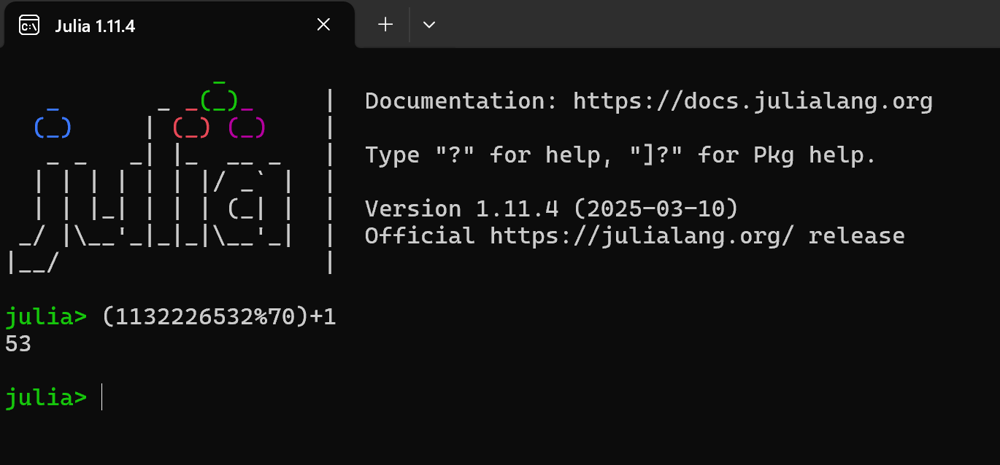

В ходе сканирования на хосте 195.239.174.0/24 были обнаружены открытые порты: 22 и 443.
Наличие данных портов указывает, что на хосте 195.239.174.0/24 установлен почтовый сервер. В этом можно убедиться перейдя по адресу https://195.239.174.1

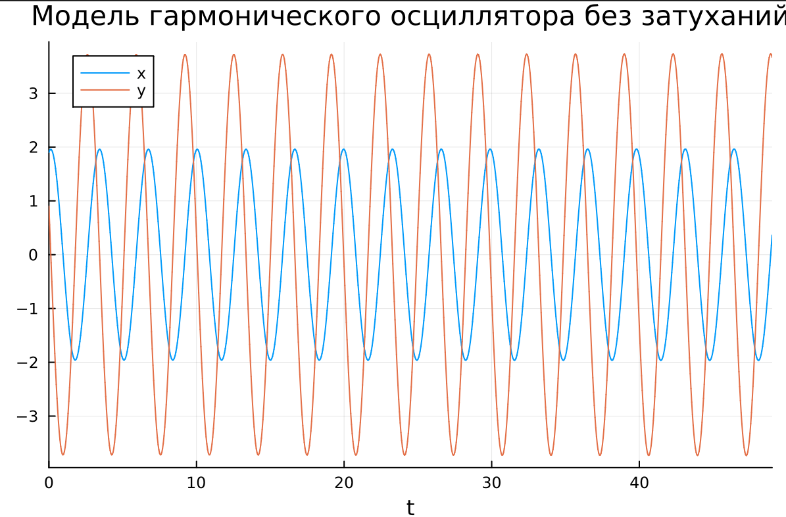

Следующим шагом необходимо определить версию Exchange Server, для этого используется режим разработчика.

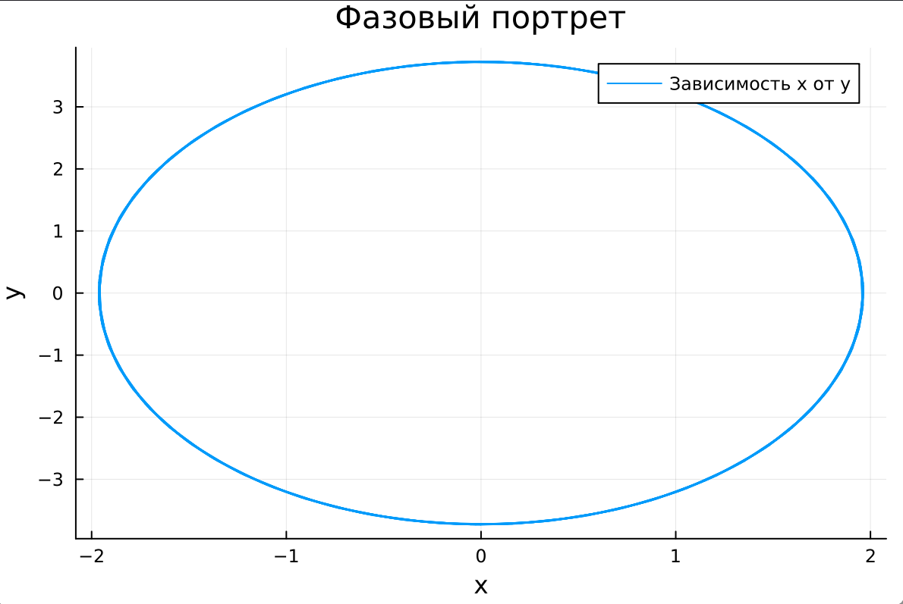

В документации Microsoft Exchange есть информация об указанных сборках и связанных с ними уязвимостях.

Для дальнейшего планирования вектора атаки будем использовать https://www.cvedetails.com.

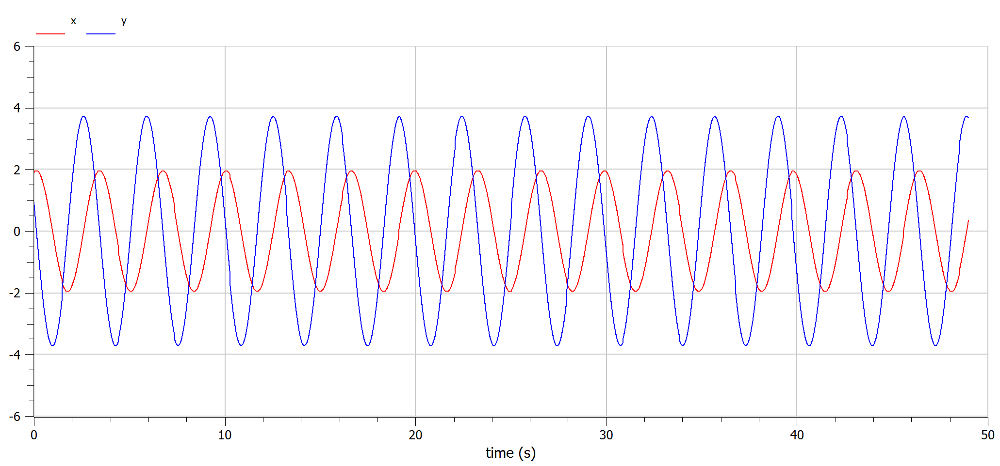

В результате настройки фильтра «Microsoft Exchange Server, Common
Vulnerability Scoring System – CVSS Scores >= 9» будет получен список уязвимостей доступных к эксплуатации. На возможность эксплуатации указывает наличие приписки public exploit exists.

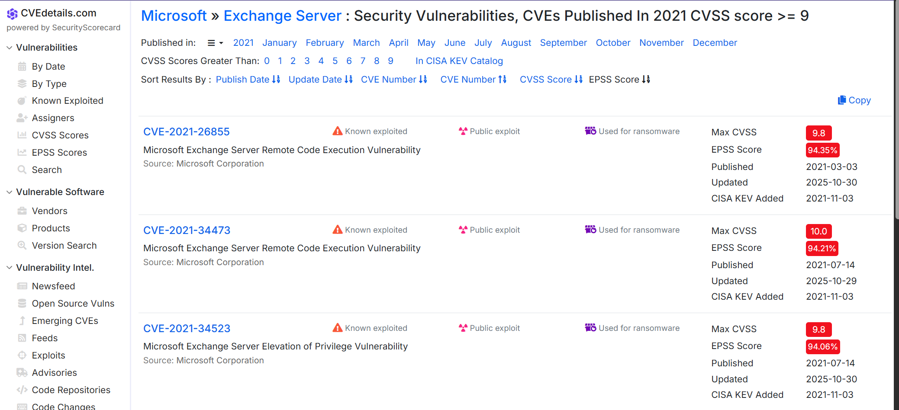

При просмотре детальной информации об уязвимостях можно убедиться, что первая дата раскрытия
информации больше даты выпуска сборки атакуемого почтового сервера, значит эти уязвимости
можно использовать.

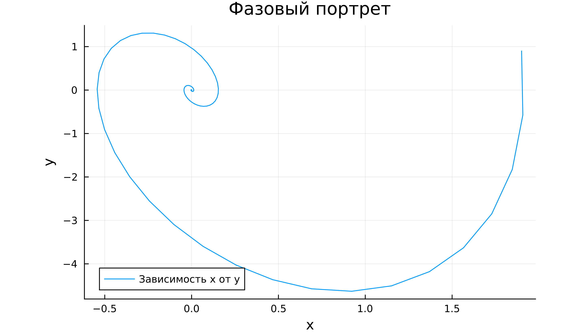

Для поиска возможных векторов атаки будем использовать модуль Metasploit. 
Для захвата флага необходимо получить сессию с удаленным хостом 195.239.174.1 с использованием возможности RCE. Далее произвести захват флага,
эксплуатируя возможность RCE двумя модулями.

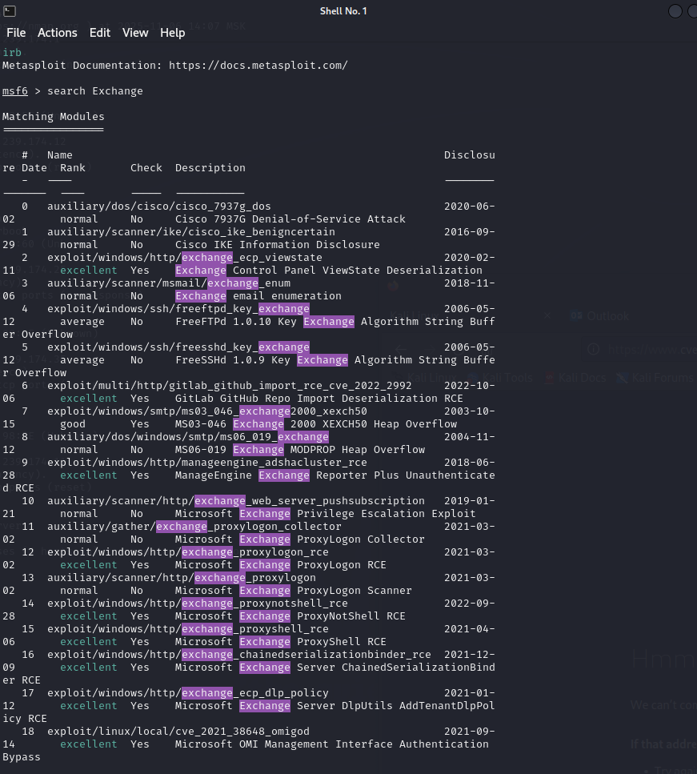

## Использование уязвимости ProxyShell

Данный модуль использует уязвимость на сервере Microsoft Exchange,
которая позволяет злоумышленнику обойти аутентификацию (CVE-2021-
31207), выдать себя за произвольного пользователя (CVE-2021-34523) и
записать произвольный файл (CVE-2021-34473) для достижения RCE.

Затем необходимо воспользоваться модулем
windows/http/exchange_proxyshell_rce. С помощью команды use 15
выбрать данный модуль и задать параметры lhost (IP-адрес атакующей
машины) и rhosts (IP-адрес целевой системы):
- set lhost 195.239.174.11;
- set rhosts 195.239.174.1.

Далее запустить модуль ProxyShell и получить meterpeter-
сессию.

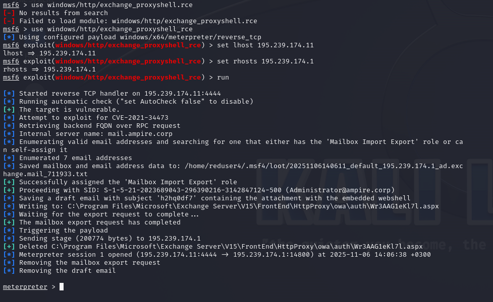

После получения сессии с почтовым сервером воспользоваться
командой cat C:/windows/system32/flag_for_red_team.txt

## Эксплуатация уязвимости ProxyLogon

Альтернативным способом захвата флага является эксплуатация уязвимости ProxyLogon.
Уязвимость ProxyLogon CVE-2021-26855 (SSRF) позволяет внешнему
атакующему обойти механизм аутентификации в MS Exchange и выдать себя
за любого пользователя. С помощью подделанного запроса на стороне сервера
атакующий может отправить произвольный HTTP-запрос, который будет
перенаправлен к другому внутреннему сервису, от имени машинного аккаунта
почтового сервера. Для эксплуатации данной уязвимости нужно получить
доступ к почтовому ящику одного из пользователей почтового сервиса.
В нижней части страницы портала portal.ampire.corp можно найти
информацию о легитимной почте одного из сотрудников.

В перечне модулей Metasploit под № 12 расположен модуль Microsoft
Exchange ProxyLogon RCE. Данный модуль использует уязвимость на сервере
Microsoft Exchange, которая позволяет злоумышленнику обойти
аутентификацию, выдать себя за администратора (CVE-2021-26855) и
записать произвольный файл (CVE-2021-27065) для получения RCE.
С использованием почты manager1@ampire.corp можно
применить данный модуль для получения соединения с удаленным узлом.
Далее задать все необходимые параметры для модуля.

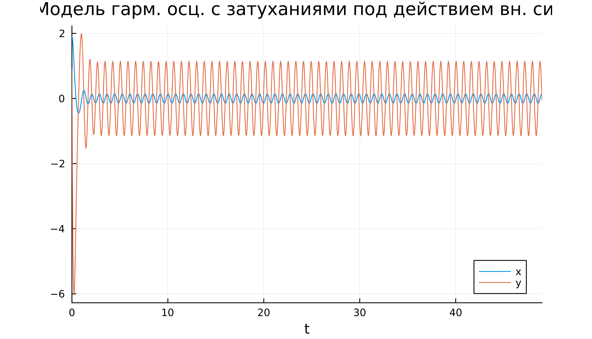

Следующим шагом необходимо запустить эксплуатацию ProxyLogon. 

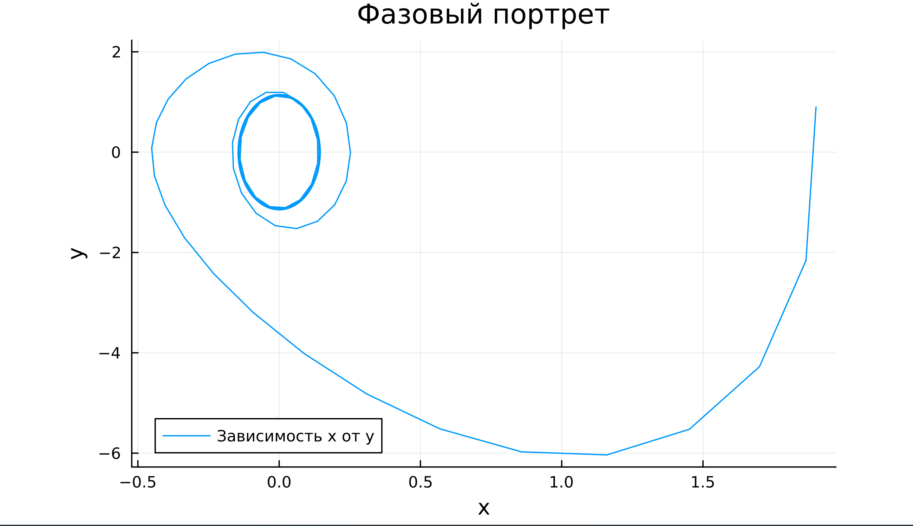

После получения сессии с почтовым сервером можно найти флаг в файле flag_for_red_team.txt

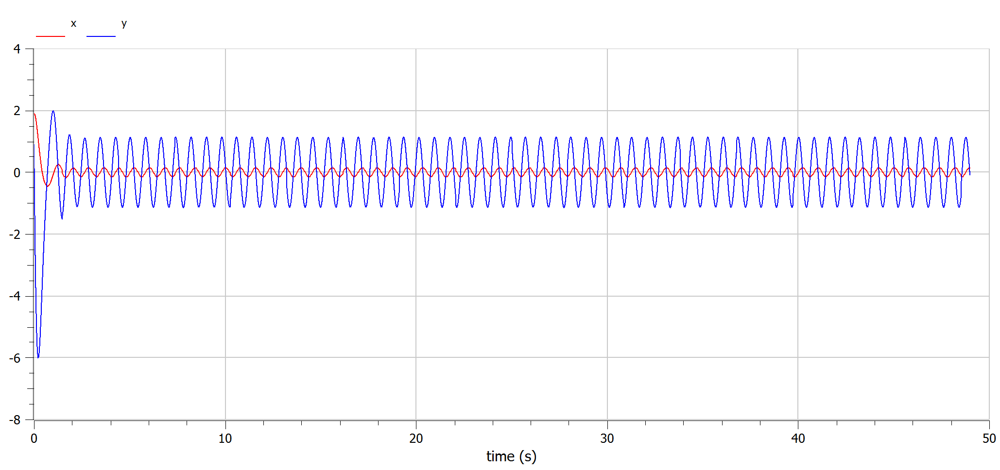

# Итоги

В результате удалось успешно произвести захват почтового сервера.

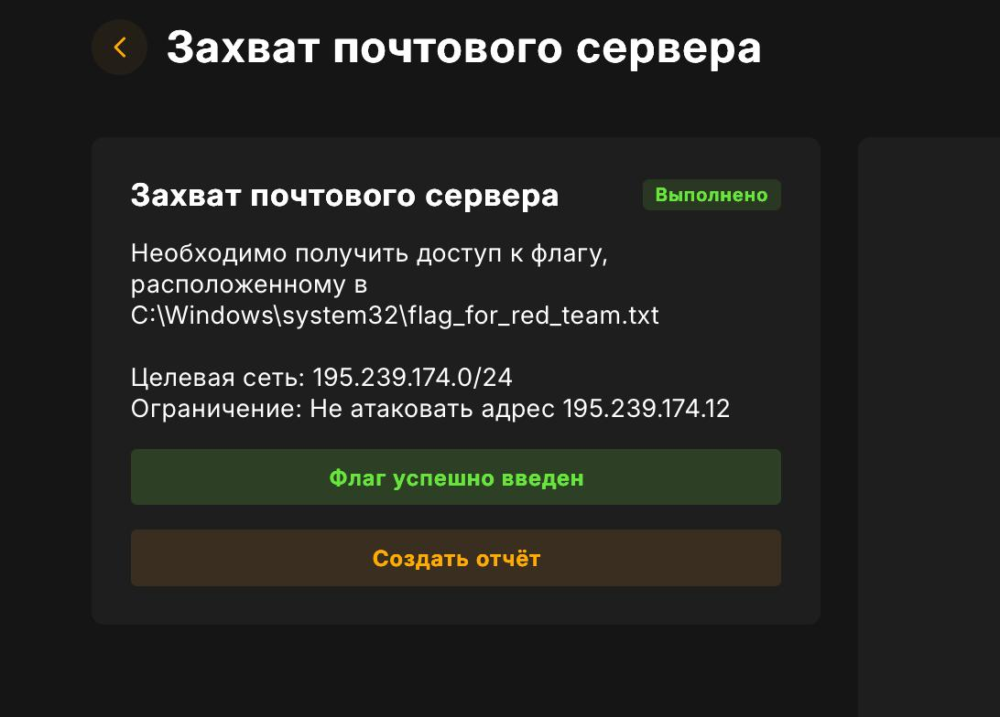

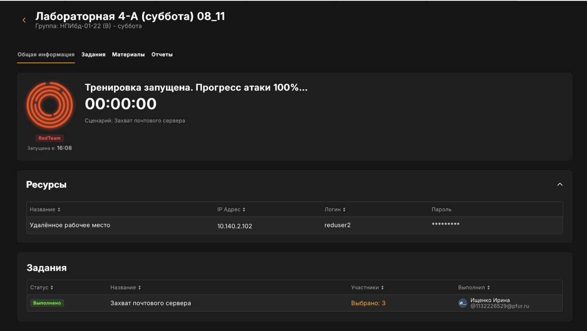

# Список литературы {.unnumbered}

::: {#refs}
:::
