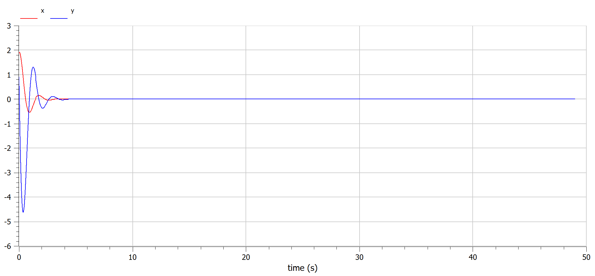
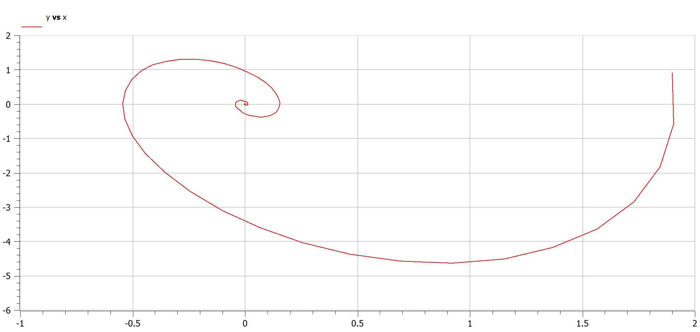
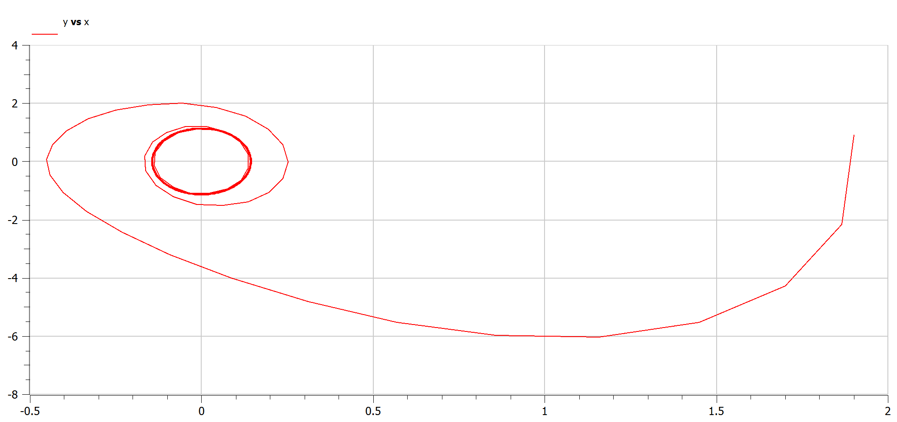

---
## Front matter
title: "Отчет по лабораторной работе №4"
subtitle: "Дисциплина: Математическое моделирование"
author: "Мишина Анастасия Алексеевна"

## Generic otions
lang: ru-RU
toc-title: "Содержание"

## Bibliography
bibliography: bib/cite.bib
csl: pandoc/csl/gost-r-7-0-5-2008-numeric.csl

## Pdf output format
toc: true # Table of contents
toc-depth: 2
lof: true # List of figures
lot: true # List of tables
fontsize: 12pt
linestretch: 1.5
papersize: a4
documentclass: scrreprt
## I18n polyglossia
polyglossia-lang:
  name: russian
  options:
	- spelling=modern
	- babelshorthands=true
polyglossia-otherlangs:
  name: english
## I18n babel
babel-lang: russian
babel-otherlangs: english
## Fonts
mainfont: IBM Plex Serif
romanfont: IBM Plex Serif
sansfont: IBM Plex Sans
monofont: IBM Plex Mono
mathfont: STIX Two Math
mainfontoptions: Ligatures=Common,Ligatures=TeX,Scale=0.94
romanfontoptions: Ligatures=Common,Ligatures=TeX,Scale=0.94
sansfontoptions: Ligatures=Common,Ligatures=TeX,Scale=MatchLowercase,Scale=0.94
monofontoptions: Scale=MatchLowercase,Scale=0.94,FakeStretch=0.9
mathfontoptions:
## Biblatex
biblatex: true
biblio-style: "gost-numeric"
biblatexoptions:
  - parentracker=true
  - backend=biber
  - hyperref=auto
  - language=auto
  - autolang=other*
  - citestyle=gost-numeric
## Pandoc-crossref LaTeX customization
figureTitle: "Рис."
tableTitle: "Таблица"
listingTitle: "Листинг"
lofTitle: "Список иллюстраций"
lotTitle: "Список таблиц"
lolTitle: "Листинги"
## Misc options
indent: true
header-includes:
  - \usepackage{indentfirst}
  - \usepackage{float} # keep figures where there are in the text
  - \floatplacement{figure}{H} # keep figures where there are in the text
---

# Цель работы

Построить математическую модель гармонического осциллятора.

# Теоретическое введение

Гармонические колебания — колебания, при которых физическая величина изменяется с течением времени по гармоническому (синусоидальному, косинусоидальному) закону [@wiki:bash].

Гармоническое колебание является специальным, частным видом периодического колебания. Периодическим называется повторяющееся движение, у которого каждый цикл в точности воспроизводит любой другой цикл. Этот специальный вид колебания очень важен, так как он чрезвычайно часто встречается в самых различных колебательных системах. Колебание груза на пружине, камертона, маятника, зажатой металлической пластинки как раз и является по своей форме гармоническим. Следует заметить, что при больших амплитудах колебания указанных систем имеют несколько более сложную форму, но они тем ближе к гармоническому, чем меньше амплитуда колебаний [@landsberg:bash]. 

Гармони́ческий осцилля́тор (в классической механике) — система, которая при выведении её из положения равновесия испытывает действие возвращающей силы F, пропорциональной смещению $x$ [@wiki:osc:bash]:

$$
F = -kx,
$$

где $k$ — постоянный коэффициент.

Если $F$ — единственная сила, действующая на систему, то систему называют простым или консервативным гармоническим осциллятором. Свободные колебания такой системы представляют собой периодическое движение около положения равновесия (гармонические колебания). Частота и амплитуда при этом постоянны, причём частота не зависит от амплитуды.

Если имеется ещё и сила трения (затухание), пропорциональная скорости движения (вязкое трение), то такую систему называют затухающим или диссипативным осциллятором. Если трение не слишком велико, то система совершает почти периодическое движение — синусоидальные колебания с постоянной частотой и экспоненциально убывающей амплитудой. Частота свободных колебаний затухающего осциллятора оказывается несколько ниже, чем у аналогичного осциллятора без трения. 

Уравнение свободных колебаний гармонического осциллятора имеет следующий вид:

$$
\ddot x + 2\gamma\dot x + \omega _0^2x = 0, \tag{1}
$$

где $x$ – переменная, описывающая состояние системы (смещение грузика, заряд конденсатора и т.д.), $\gamma$ -- параметр, характеризующий потери энергии (трение в механической системе, сопротивление в контуре), $\omega _0$ – собственная частота колебаний, $t$ – время. (Обозначения $\ddot x = \dfrac{\partial^2x}{\partial t^2}$, $\dot x = \dfrac{\partial x}{\partial t}$) 

Уравнение (1) есть линейное однородное дифференциальное уравнение второго порядка и оно является примером линейной динамической системы.
При отсутствии потерь в системе ($\gamma = 0$) вместо уравнения (1) получаем уравнение консервативного осциллятора энергия колебания которого сохраняется во времени:

$$
\ddot x + \omega _0 ^2 = 0. \tag{2}
$$

Для однозначной разрешимости уравнения второго порядка (2) необходимо задать два начальных условия вида

$$
\begin{cases}
 x(t_0) = x_0, \\ \tag{3}
 \dot x(t_0) = y_0.
\end{cases}
$$

где $x(y)$ – численности войск первой (второй) стороны в момент времени $t$; $a_x$ ($a_y$) – эффективность огня первой (второй) стороны (число поражаемых целей противника в единицу времени)1; p и q – параметры степени. В начальный момент времени заданы численности сторон: $x(0) = x_0$ и $y(0) = y_0$.

Уравнение второго порядка (2) можно представить в виде системы двух уравнений первого порядка:

$$
\begin{cases}
  \dot x = y, \\ \tag{4}
  \dot y = -\omega _0 ^2 x
\end{cases}
$$

Начальные условия (3) для системы (4) примут вид:

$$
\begin{cases}
 x(t_0) = x_0, \\ \tag{5}
 y(t_0) = y_0.
\end{cases}
$$

Независимые переменные $x$, $y$ определяют пространство, в котором «движется» решение. Это фазовое пространство системы, поскольку оно двумерно будем называть его фазовой плоскостью.

Значение фазовых координат $x$, $y$ в любой момент времени полностью определяет состояние системы. Решению уравнения движения как функции времени отвечает гладкая кривая в фазовой плоскости. Она называется фазовой траекторией. Если множество различных решений (соответствующих различным начальным условиям) изобразить на одной фазовой плоскости, возникает общая картина поведения системы. Такую картину, образованную набором фазовых траекторий, называют фазовым портретом.
 
# Задание

## Определение варианта

Использую формулу для определения варианта задания (рис. [-@fig:1]).

{#fig:1 width=70%}

## Задание

Построить фазовый портрет гармонического осциллятора и решение уравнения гармонического осциллятора для следующих случаев:

1. Колебания гармонического осциллятора без затуханий и без действий внешней силы

  $$\ddot{x} + 1.9x = 0 $$

2. Колебания гармонического осциллятора c затуханием и без действий внешней силы 
  
  $$\ddot x + 2.9 \dot x + 3.9 x = 0 $$

3. Колебания гармонического осциллятора c затуханием и под действием внешней силы 
   
   $$\ddot x + 4.9 \dot x + 5.9 x = 6.9 sin(7.9 t)$$
   
На интервале $t \in [0; 49]$ (шаг 0.05) с начальными условиями $x_0 = 1.9,  y_0=0.9$.

# Выполнение лабораторной работы

## Модель колебаний гармонического осциллятора без затуханий и без действий внешней силы

### Julia

Реализуем модель на языке программирования Julia:

```Julia
# Используемые библиотеки
using DifferentialEquations, Plots;

# Начальные условия
tspan = (0, 49)
u0 = [1.9, 0.9]
p1 = [0, 1.9]

# Задание функции
function f1(u, p, t)
	x, y = u
	g, w = p
	dx = y
	dy = -g .*y - w^2 .*x
	return [dx, dy]
end

# Постановка проблемы и ее решение
problem1 = ODEProblem(f1, u0, tspan, p1)
sol1 = solve(problem1, Tsit5(), saveat = 0.05)
```

Построим график решения и фазовый портрет:

```Julia
plot(sol1, title = "Модель гармонического осциллятора без затуханий", label = ["x" "y"], xaxis = "t")
plot(sol1, idxs=(1, 2), title = "Фазовый портрет", label = "Зависимость х от у", xaxis = "x", yaxis = "y")
```

В результате получаем график решения уравнения гармонического осциллятора без затуханий (рис. [-@fig:2]) и его фазового портрета (рис. [-@fig:3]).

{#fig:2 width=70%}

{#fig:3 width=70%}

### OpenModelica

Реализуем эту же модель на OpenModelica.

```
model lab4_1
  parameter Real g = 0;
  parameter Real w = 1.9;
  parameter Real x0 = 1.9;
  parameter Real y0 = 0.9;
  Real x(start=x0);
  Real y(start=y0);
equation
  der(x) = y;
  der(y) = -g .*y - w^2 .*x;
end lab4_1;
```

Посмотрим график решения (рис. [-@fig:4]) и фазовый портрет (рис. [-@fig:5]).

{#fig:4 width=70%}

{#fig:5 width=70%}

Графики идентичны.

## Модель колебаний гармонического осциллятора с затуханиями и без действий внешней силы

### Julia

Реализуем модель на Julia, используя те же начальные условия и функцию, что и в первом случае (кроме параметров уравнения):

```Julia

# Начальные условия
p2 = [2.9, 3.9]

# Постановка проблемы и ее решение
problem2 = ODEProblem(f1, u0, tspan, p2)
sol2 = solve(problem2, Tsit5(), saveat = 0.05)
```

Построим график решения и фазовый портрет:

```Julia
plot(sol2, title = "Модель гармонического осциллятора с затуханиями", label = ["x" "y"], xaxis = "t")
plot(sol2, idxs=(1, 2), title = "Фазовый портрет", label = "Зависимость х от у", xaxis = "x", yaxis = "y")
```

В результате получаем график решения уравнения гармонического осциллятора с затуханиями (рис. [-@fig:6]) и его фазового портрета (рис. [-@fig:7]).

{#fig:6 width=70%}

{#fig:7 width=70%}

В данном случае в результате колебаний график затухает.

### OpenModelica

Реализуем эту же модель на OpenModelica.

```
model lab4_2
  parameter Real g = 2.9;
  parameter Real w = 3.9;
  parameter Real x0 = 1.9;
  parameter Real y0 = 0.9;
  Real x(start=x0);
  Real y(start=y0);
equation
  der(x) = y;
  der(y) = -g .*y - w^2 .*x;
end lab4_2;
```

Посмотрим график решения (рис. [-@fig:8]) и фазовый портрет (рис. [-@fig:9]).

{#fig:8 width=70%}

{#fig:9 width=70%}

Также заметим идентичность графика.

## Модель колебаний гармонического осциллятора с затуханиями и под действием внешней силы

### Julia

Для реализации обновим параметры уравнения p3 и создадим на основе функции f1 функцию f2, учитывающую внешнюю силу:

```Julia

# Начальные условия
p3 = [4.9, 5.9]

# Функция, описывающая внешние силы, действующие на осциллятор
f(t) = 6.9*sin(7.9*t)

# Задание функции
function f2(u, p, t)
	x, y = u
	g, w = p
	dx = y
	dy = -g .*y - w^2 .*x .+f(t)
	return [dx, dy]
end

# Постановка проблемы и ее решение
problem3 = ODEProblem(f2, u0, tspan, p3)
sol3 = solve(problem3, Tsit5(), saveat = 0.05)
```

Построим график решения и фазовый портрет:

```Julia
plot(sol3, title = "Модель гарм. осц. с затуханиями под действием вн. силы", label = ["x" "y"], xaxis = "t")
plot(sol3, idxs=(1, 2), title = "Фазовый портрет", label = "Зависимость х от у", xaxis = "x", yaxis = "y")
```

В результате получаем график решения уравнения гармонического осциллятора с затуханиями (рис. [-@fig:10]) и его фазового портрета (рис. [-@fig:11]).

{#fig:10 width=70%}

{#fig:11 width=70%}

### OpenModelica

Реализуем эту же модель на OpenModelica:

```
model lab4_3
  parameter Real g = 4.9;
  parameter Real w = 5.9;
  parameter Real x0 = 1.9;
  parameter Real y0 = 0.9;
  Real x(start=x0);
  Real y(start=y0);
equation
  der(x) = y;
  der(y) = -g .*y - w^2 .*x + 6.9*sin(7.9*time);
end lab4_3;
```

Посмотрим график решения (рис. [-@fig:12]) и фазовый портрет (рис. [-@fig:13]).

{#fig:12 width=70%}

{#fig:13 width=70%}

Также заметим идентичность графика.

# Выводы

В ходе выполнения лабораторной работы я построила математическую модель гармонического осциллятора.

# Список литературы{.unnumbered}

::: {#refs}
:::
