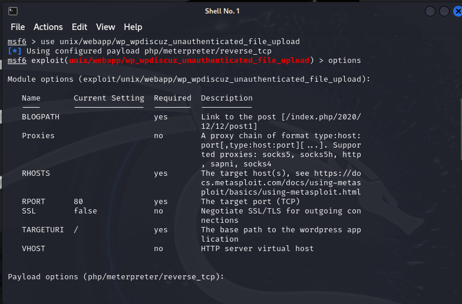
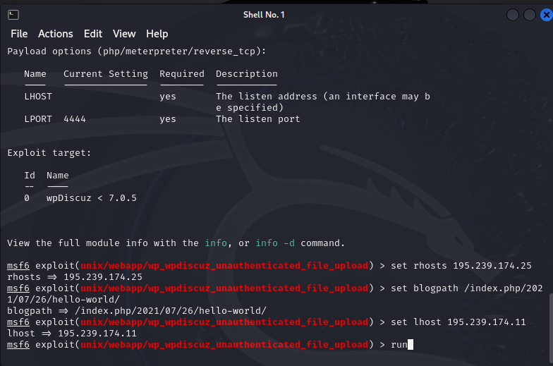
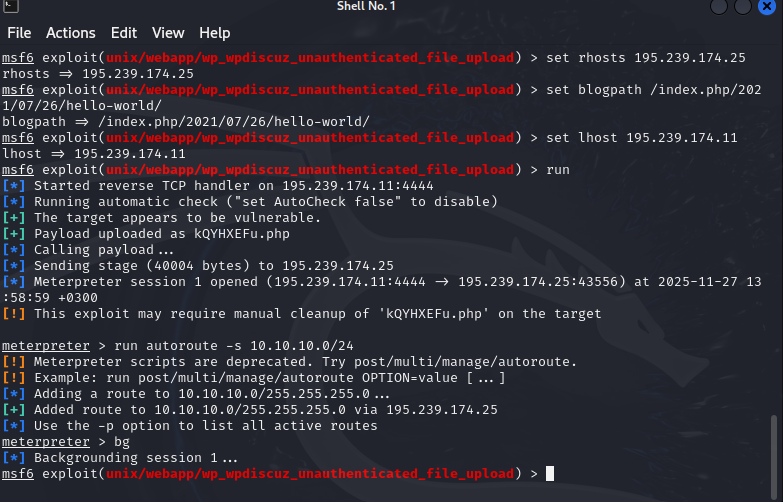
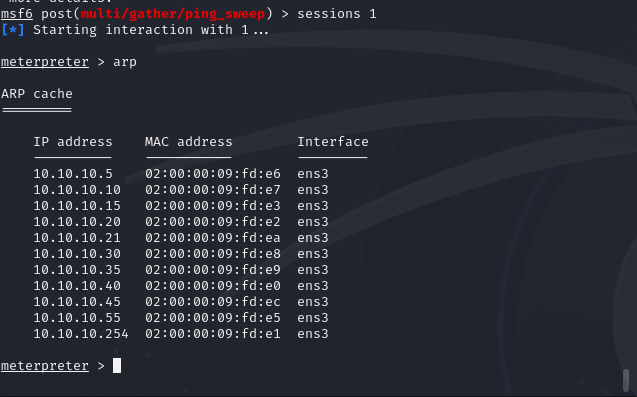
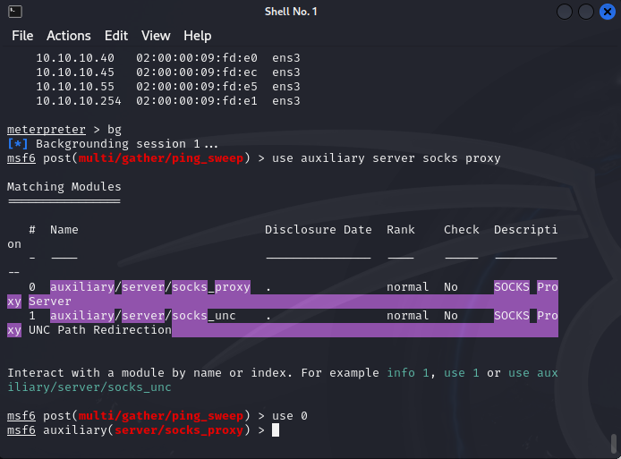
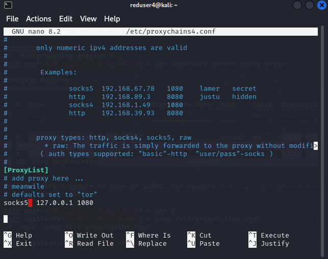
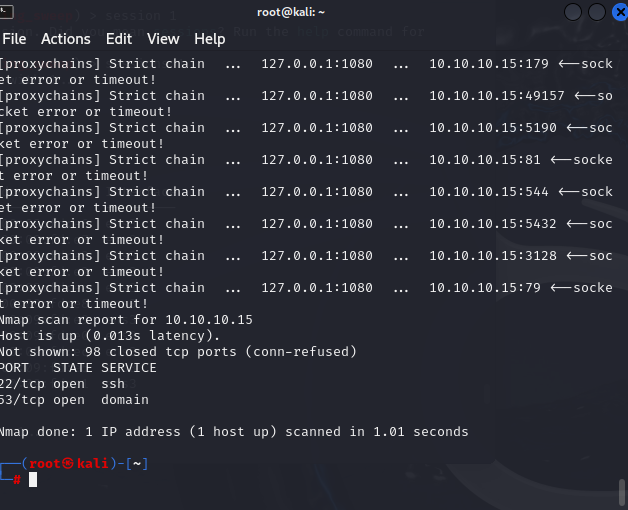

---
## Front matter
lang: ru-RU
title: Лабораторная работа 5-D
subtitle: Кибербезопасность предприятия
author:
- Ищенко Ирина 
- Мишина Анастасия 
- Дикач Анна 
- Галацан Николай 
- Амуничников Антон 
- Барсегян Вардан 
- Дудырев Глеб 
- Дымченко Дмитрий
institute:
  - Российский университет дружбы народов, Москва, Россия
date: 

## i18n babel
babel-lang: russian
babel-otherlangs: english

## Formatting pdf
toc: false
toc-title: Содержание
slide_level: 2
aspectratio: 169
section-titles: true
theme: metropolis
header-includes:
 - \metroset{progressbar=frametitle,sectionpage=progressbar,numbering=fraction}
---

##  Наша команда

  * НПИбд-01-22 
  * Российский университет дружбы народов

## Цель тренировки

Во внутреннем сегменте организации необходимо получить доступ к
DNS-серверу и найти флаг в одной из DNS-записей.

# Выполнение лабораторной работы
 
## Получение meterpreter-сессии с узлом в сегменте DMZ

Получим meterpreter-сессию с корпоративным сайтом с помощью модуля wp_wpdiscuz_unauthenticated_file_upload 

## Получение meterpreter-сессии с узлом в сегменте DMZ

## Проброс портов

После получения сессии можно переходить к процедуре поиска нужного
сервера. В первую очередь выполнить проброс портов во внутреннюю сеть с
помощью команды autoroute и запустить данную сеть – run
autoroute -s 10.10.10.0/24

## Поиск DNS-сервера

Далее необходимо свернуть сессию (команда bg) и с помощью модуля
multi/gather/ping_sweep сканировать внутреннюю сеть организации для
выбора адреса, который может быть использован для дальнейшей атаки.
Провести поиск DNS-сервера.

## Поиск DNS-сервера

## Хосты во внетренней сети организации

С помощью команды route распечатать маршруты, которые
обнаружены Metasploit. Далее вернуться в сессию с почтовым сервером (sessions {N}) и отобразить хосты, которые находятся во внутренней сети организации

## Хосты во внетренней сети организации

## Прокси модуль metasploit auxiliary/server/socks_proxy

Свернуть сессию (команда bg), далее найти и выбрать модуль
metasploit auxiliary/server/socks_proxy

## Настройка прокси

Настроить модуль в соответствии с параметрами, которые указаны в
конфигурационном файле /etc/proxychains.conf

## Настройка прокси

## Список открытых портов

Далее открыть новый терминал kali. В новом терминале запустить
сканирование 100 самых часто используемых портов с помощью команды
proxychains nmap –n –sT –Pn --top-ports 100 {IP}.
В результате сканирования будет получен список открытых портов

## Список открытых портов

## Узел - цель атаки

По стандарту RFC 1035 все DNS-серверы отвечают на порту 53 TCP и
UDP. По результатам сканирования можно сделать вывод, что узел 10.10.10.15
является целью атаки – DNS-сервером с открытым 22 портом SSH

## Перебор паролей

Для реализации атаки перебором паролей использовать словарь
rockyou.txt, который находится по пути /usr/share/wordlist/. Логин пользователя можно получить с помощью файла userlist в
директории /usr/share/wordlists с именами пользователей. Выбрать
пользователя «user», далее запустить утилиту hydra с помощью команды
proxychains hydra -V -f -l user -P rockyou.txt -t 32 10.10.10.15
ssh. 

## Перебор паролей

## Получение DNS-флага

Для получения доступа к DNS-серверу можно воспользоваться
подключением по SSH по полученным учетным данным или модулем
metasploit auxiliary/scanner/ssh/ssh_login с указанием параметров
для входа.
Подключение по SSH по полученным учетным данным осуществляется
с помощью команды proxychains ssh user@10.10.10.15.
Далее необходимо ввести найденный пароль.

В рамках лабораторной работы были испробаваны оба способа для получения флага.

## Получение DNS-флага

## Итог

