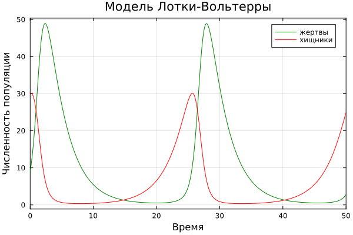
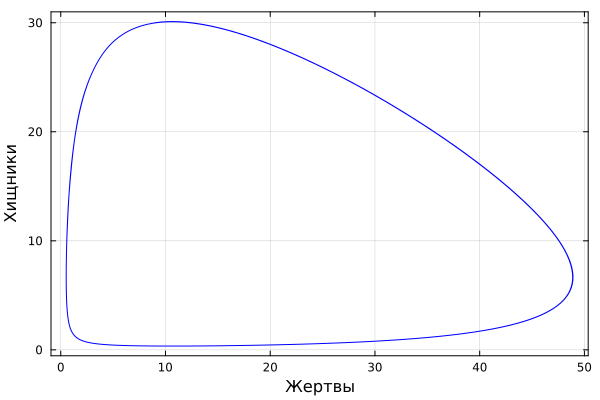
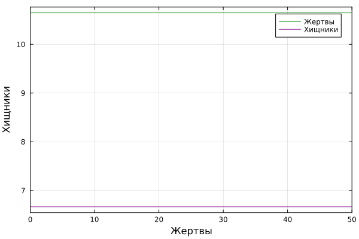
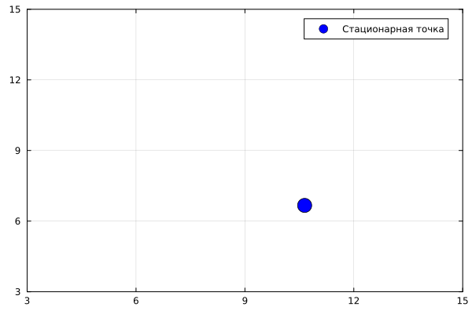
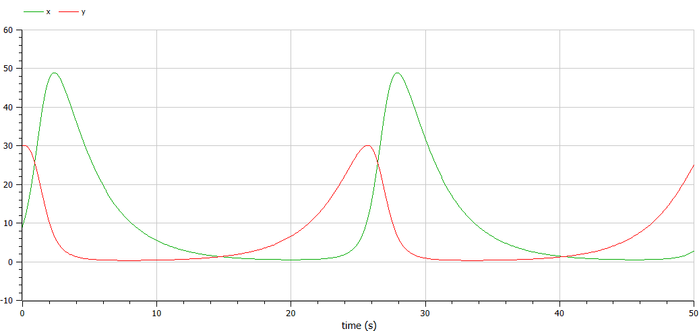
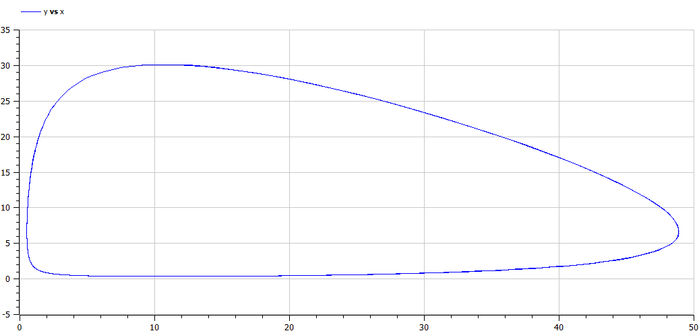
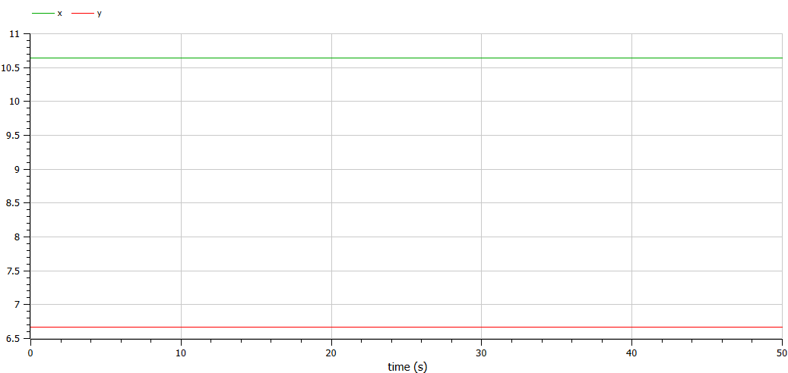

---
## Front matter
title: "Лабораторная работа №5"
subtitle: "Дисциплина: Математическое моделирование"
author: "Мишина Анастасия Алексеевна"

## Generic otions
lang: ru-RU
toc-title: "Содержание"

## Bibliography
bibliography: bib/cite.bib
csl: pandoc/csl/gost-r-7-0-5-2008-numeric.csl

## Pdf output format
toc: true # Table of contents
toc-depth: 2
lof: true # List of figures
lot: true # List of tables
fontsize: 12pt
linestretch: 1.5
papersize: a4
documentclass: scrreprt
## I18n polyglossia
polyglossia-lang:
  name: russian
  options:
	- spelling=modern
	- babelshorthands=true
polyglossia-otherlangs:
  name: english
## I18n babel
babel-lang: russian
babel-otherlangs: english
## Fonts
mainfont: IBM Plex Serif
romanfont: IBM Plex Serif
sansfont: IBM Plex Sans
monofont: IBM Plex Mono
mathfont: STIX Two Math
mainfontoptions: Ligatures=Common,Ligatures=TeX,Scale=0.94
romanfontoptions: Ligatures=Common,Ligatures=TeX,Scale=0.94
sansfontoptions: Ligatures=Common,Ligatures=TeX,Scale=MatchLowercase,Scale=0.94
monofontoptions: Scale=MatchLowercase,Scale=0.94,FakeStretch=0.9
mathfontoptions:
## Biblatex
biblatex: true
biblio-style: "gost-numeric"
biblatexoptions:
  - parentracker=true
  - backend=biber
  - hyperref=auto
  - language=auto
  - autolang=other*
  - citestyle=gost-numeric
## Pandoc-crossref LaTeX customization
figureTitle: "Рис."
tableTitle: "Таблица"
listingTitle: "Листинг"
lofTitle: "Список иллюстраций"
lotTitle: "Список таблиц"
lolTitle: "Листинги"
## Misc options
indent: true
header-includes:
  - \usepackage{indentfirst}
  - \usepackage{float} # keep figures where there are in the text
  - \floatplacement{figure}{H} # keep figures where there are in the text
---

# Цель работы

Исследовать математическую модель Лотки-Волтьерры.

# Задание

Для модели «хищник-жертва»:

$$\begin{cases}
    &\dfrac{dx}{dt} = - 0.34 x(t) + 0.051 x(t)y(t) \\
    &\dfrac{dy}{dt} = 0.33 y(t) - 0.031 x(t)y(t)
\end{cases}$$

Построить график зависимости численности хищников от численности жертв, а также графики изменения численности хищников и численности жертв при следующих начальных условиях: $x_0 = 9, y_0 = 30.$ Найти стационарное состояние системы.

# Теоретическое введение

Модель "Хищник-жертва" основывается на следующих предположениях [@book]:

1. Численность популяции жертв $x$ и хищников $y$ зависят только от времени (модель не учитывает пространственное распределение популяции на занимаемой территории)

2. В отсутствии взаимодействия численность видов изменяется по модели Мальтуса (экспоненциальный рост с постоянным темпом), при этом число жертв увеличивается, а число хищников падает

3. Естественная смертность жертвы и естественная рождаемость хищника считаются несущественными

4. Эффект насыщения численности обеих популяций не учитывается

5. Скорость роста численности жертв уменьшается пропорционально численности хищников

$$\begin{cases}
  &\dfrac{dx}{dt} = ax(t)-bx(t)y(t)\\
  &\dfrac{dy}{dt} = -cy(t)+dx(t)y(t)
\end{cases}$$

В этой модели $x$ – число жертв, $y$ - число хищников. Коэффициент $a$ описывает скорость естественного прироста числа жертв в отсутствие хищников, $c$ - естественное вымирание хищников, лишенных пищи в виде жертв. Вероятность взаимодействия жертвы и хищника считается пропорциональной как количеству жертв, так и числу самих хищников. Каждый акт взаимодействия уменьшает популяцию жертв, но способствует увеличению популяции хищников (члены $-bxy$ и $dxy$ в правой части уравнения). 

Найдём стационарное состояние системы. Для этого приравняем её правые части к нулю.

$$\begin{cases}
  ax(t)-bx(t)y(t) = 0\\
  -cy(t)+dx(t)y(t) = 0
\end{cases}$$

Из полученной системы получаем, что стационарное состояние системы будет в точке $x_0 = c/d$, $y_0 = a/b$. Если начальные значения задать в стационарном состоянии $x(0) = x_0$, $y(0) = y_0$, то в любой момент времени численность популяций изменяться не будет. При малом отклонении от положения равновесия численности как хищника, так и жертвы с течением времени не возвращаются к равновесным значениям, а совершают периодические колебания вокруг стационарной точки.

# Выполнение лабораторной работы

Для выполнения лабораторной работы будем использовать язык программирования Julia и ПО OpenModelica.

## Реализация на Julia

Напишем код для решения системы ДУ, используя библиотеки DifferentialEquations, а затем построим графики с помощью библиотеки Plots.

```Julia
# Используемые библиотеки
using DifferentialEquations, Plots

# Задание системы ДУ, описывающей модель Лотки-Вольтерры
function LV(u, p, t)
    x, y = u
    a, b, c, d = p
    dx = a*x - b*x*y
    dy = -c*y + d*x*y
    return [dx, dy]
end

# Начальные условия
u0 = [9, 30]
p = [-0.34, -0.051, -0.33, -0.031]
tspan = (0.0, 50.0)

# Постановка проблемы и ее решение
prob = ODEProblem(LV, u0, tspan, p)
sol = solve(prob, Tsit5())

# Построение графика
plot(sol, title = "Модель Лотки-Вольтерры", xaxis = "Время", yaxis = "Численность популяции", label = ["жертвы" "хищники"], c = ["green" "red"], box =:on)
```

В результате получаем следующие графики изменения численности хищников и численности жертв (рис. [-@fig:1]), и зависимости численности хищников от численности жертв (рис. [-@fig:2]).

{#fig:1 width=70%}

{#fig:2 width=70%}

Графики периодичны, фазовый портрет замкнут, как и должно быть в жесткой модели Лотки-Вольтерры.

Далее найдем стационарное состояние системы по формуле:

$$\begin{cases}
  &x_0 = \dfrac{\gamma}{\delta}\\
  &y_0 = \dfrac{\alpha}{\beta}
\end{cases}
$$

В результате, $x_0 = \dfrac{0.33}{0.031} = 10.645161290322582$, а $y_0 = \dfrac{0.34}{0.051} = 6.666666666666668$.

Проверим, что эта точка действительно является стационарной, подставив в начальные условия.

```Julia
u0_c = [x_c, y_c]
prob2 = ODEProblem(LV, u0_c, tspan, p)
sol2 = solve(prob2, Tsit5())

plot(sol2, xaxis = "Жертвы", yaxis = "Хищники", label = ["Жертвы" "Хищники"], c = ["green" "purple"], box =:on)
plot((x_c, y_c), seriestype=:scatter, xlims=(3, 15), ylims=(3, 15), box =:on, c = "blue", markersize=10, label = "Стационарная точка")
```

Получаем график из двух прямых, параллельных оси абсцисс, то есть численность жертв и хищников не меняется, как и должно быть в стационарном состоянии (рис. [-@fig:3]).

{#fig:3 width=70%}

Фазовый портрет в стационарном состоянии выглядит следующим образом (рис. [-@fig:4]).

{#fig:4 width=70%}

## Реализация на OpenModelica

Зададим параметры и систему ДУ.

```
model lab5_1
  parameter Real a = -0.34;
  parameter Real b = -0.051;
  parameter Real c = -0.33;
  parameter Real d = -0.031;
  parameter Real x0 = 9;
  parameter Real y0 = 30;

  Real x(start=x0);
  Real y(start=y0);
equation
    der(x) = a*x - b*x*y;
    der(y) = -c*y + d*x*y;
end lab5_1;
```

Выполним симуляцию на интервале (0, 50) (такой же брали и в Julia), получим следующие графики изменения численности хищников и численности жертв (рис. [-@fig:5]), и зависимости численности хищников от численности жертв (рис. [-@fig:6]).

{#fig:5 width=70%}

{#fig:6 width=70%}

Графики периодичны, фазовый портрет замкнут, как и должно быть в жесткой модели Лотки-Вольтерры.

Также построим тут ищменения численности хищников и численности жертв в стационарном состоянии.

```
model lab5_2
  parameter Real a = -0.34;
  parameter Real b = -0.051;
  parameter Real c = -0.33;
  parameter Real d = -0.031;
  parameter Real x0 = 0.33/0.031;
  parameter Real y0 = 0.34/0.051;

  Real x(start=x0);
  Real y(start=y0);
equation
    der(x) = a*x - b*x*y;
    der(y) = -c*y + d*x*y;
end lab5_2;
```

Получим график, в котором численность жертв и хищников постоянна (рис. [-@fig:7]).

{#fig:7 width=70%}

Полученные графики на Julia и OpenModelica идентичны, никаких особых различий не видно.

# Выводы

В результате выполнения лабораторной работы я построила математическую модель Лотки-Вольтерры на Julia и в OpenModelica.

# Список литературы{.unnumbered}

::: {#refs}
:::
