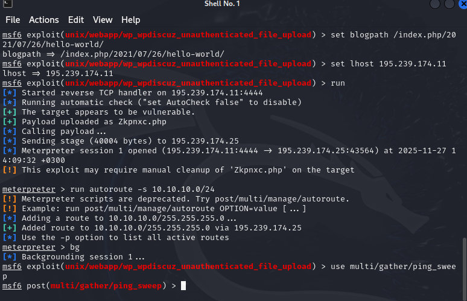
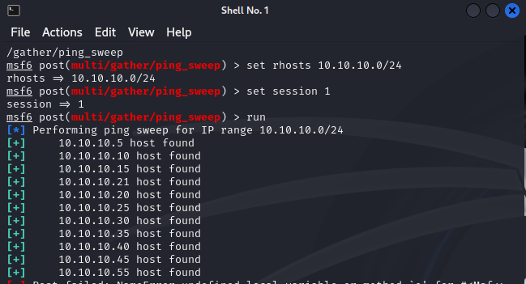
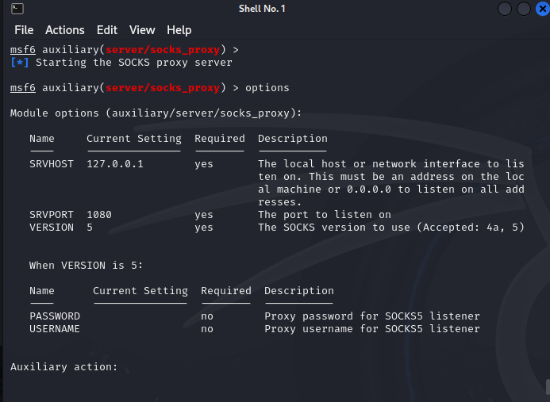
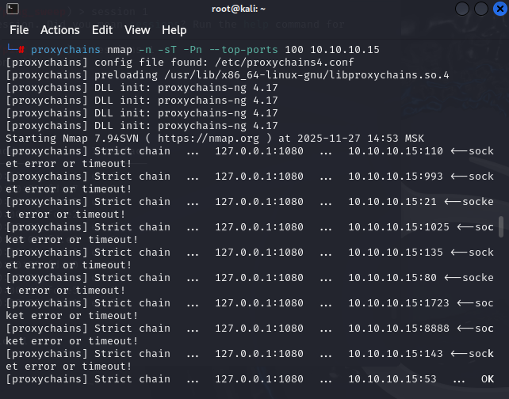
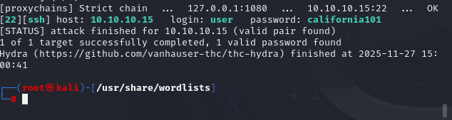
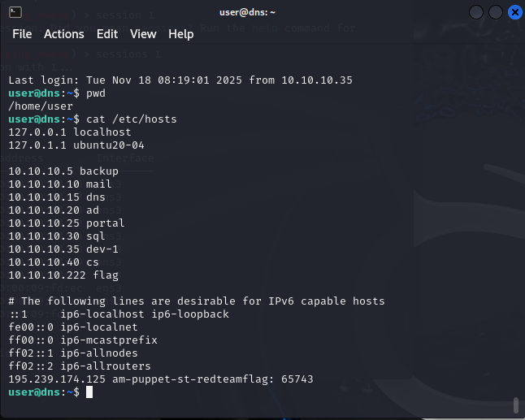
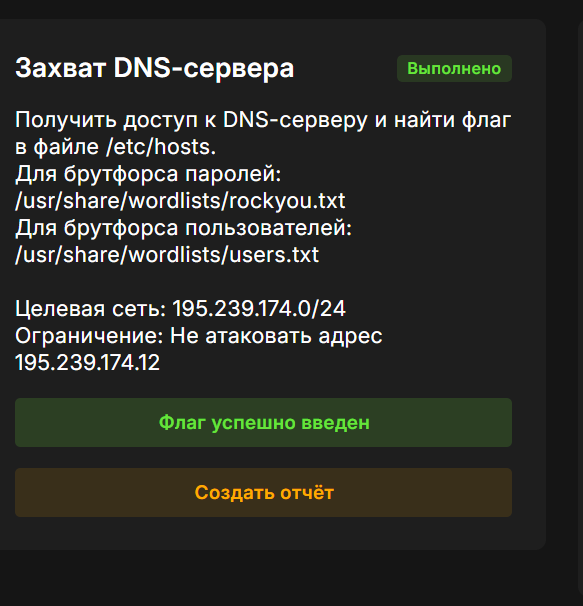

---
## Front matter
title: "Лабораторная работа 5-D"
subtitle: "Кибербезопасность предприятия"
author: 
- Ищенко Ирина 
- Мишина Анастасия 
- Дикач Анна 
- Галацан Николай 
- Амуничников Антон 
- Барсегян Вардан 
- Дудырев Глеб 
- Дымченко Дмитрий

## Generic otions
lang: ru-RU
toc-title: "Содержание"

## Bibliography
bibliography: bib/cite.bib
csl: pandoc/csl/gost-r-7-0-5-2008-numeric.csl

## Pdf output format
toc: true # Table of contents
toc-depth: 2
lof: true # List of figures
lot: true # List of tables
fontsize: 12pt
linestretch: 1.5
papersize: a4
documentclass: scrreprt
## I18n polyglossia
polyglossia-lang:
  name: russian
  options:
  - spelling=modern
  - babelshorthands=true
polyglossia-otherlangs:
  name: english
## I18n babel
babel-lang: russian
babel-otherlangs: english
## Fonts
mainfont: IBM Plex Serif
romanfont: IBM Plex Serif
sansfont: IBM Plex Sans
monofont: IBM Plex Mono
mathfont: STIX Two Math
mainfontoptions: Ligatures=Common,Ligatures=TeX,Scale=0.94
romanfontoptions: Ligatures=Common,Ligatures=TeX,Scale=0.94
sansfontoptions: Ligatures=Common,Ligatures=TeX,Scale=MatchLowercase,Scale=0.94
monofontoptions: Scale=MatchLowercase,Scale=0.94,FakeStretch=0.9
mathfontoptions:
## Biblatex
biblatex: true
biblio-style: "gost-numeric"
biblatexoptions:
  - parentracker=true
  - backend=biber
  - hyperref=auto
  - language=auto
  - autolang=other*
  - citestyle=gost-numeric
## Pandoc-crossref LaTeX customization
figureTitle: "Рис."
tableTitle: "Таблица"
listingTitle: "Листинг"
lofTitle: "Список иллюстраций"
lotTitle: "Список таблиц"
lolTitle: "Листинги"
## Misc options
indent: true
header-includes:
  - \usepackage{indentfirst}
  - \usepackage{float} # keep figures where there are in the text
  - \floatplacement{figure}{H} # keep figures where there are in the text
---

# Цель тренировки

Во внутреннем сегменте организации необходимо получить доступ к
DNS-серверу и найти флаг в одной из DNS-записей.

# Выполнение лабораторной работы
 
## Получение meterpreter-сессии с узлом в сегменте DMZ

Получим meterpreter-сессию с корпоративным сайтом с помощью модуля wp_wpdiscuz_unauthenticated_file_upload 

## Получение DNS-флага

После получения сессии можно переходить к процедуре поиска нужного
сервера. В первую очередь выполнить проброс портов во внутреннюю сеть с
помощью команды autoroute и запустить данную сеть – run
autoroute -s 10.10.10.0/24

Далее необходимо свернуть сессию (команда bg) и с помощью модуля
multi/gather/ping_sweep сканировать внутреннюю сеть организации для
выбора адреса, который может быть использован для дальнейшей атаки.
Провести поиск DNS-сервера.

С помощью команды route распечатать маршруты, которые
обнаружены Metasploit. Далее вернуться в сессию с почтовым сервером (sessions {N}) и отобразить хосты, которые находятся во внутренней сети организации

Проверить наличие открытых портов на хостах, которые находятся во
внутренней сети организации, с помощью модуля nmap. Поскольку
сканируемые хосты находятся во внутренней сети, в первую очередь
необходимо настроить прокси, через который будут проходить все запросы
при сканировании. Для этого можно использовать модуль metasploit
auxiliary/server/socks_proxy.
Свернуть сессию (команда bg), далее найти и выбрать модуль
metasploit auxiliary/server/socks_proxy

Настроить модуль в соответствии с параметрами, которые указаны в
конфигурационном файле /etc/proxychains.conf

Далее открыть новый терминал kali. В новом терминале запустить
сканирование 100 самых часто используемых портов с помощью команды
proxychains nmap –n –sT –Pn --top-ports 100 {IP}.
В результате сканирования будет получен список открытых портов

По стандарту RFC 1035 все DNS-серверы отвечают на порту 53 TCP и
UDP. По результатам сканирования можно сделать вывод, что узел 10.10.10.15
является целью атаки – DNS-сервером с открытым 22 портом SSH

Для реализации атаки перебором паролей использовать словарь
rockyou.txt, который находится по пути /usr/share/wordlist/. Логин пользователя можно получить с помощью файла userlist в
директории /usr/share/wordlists с именами пользователей. Выбрать
пользователя «user», далее запустить утилиту hydra с помощью команды
proxychains hydra -V -f -l user -P rockyou.txt -t 32 10.10.10.15
ssh. 

Для получения доступа к DNS-серверу можно воспользоваться
подключением по SSH по полученным учетным данным или модулем
metasploit auxiliary/scanner/ssh/ssh_login с указанием параметров
для входа.
Подключение по SSH по полученным учетным данным осуществляется
с помощью команды proxychains ssh user@10.10.10.15.
Далее необходимо ввести найденный пароль.

В рамках лабораторной работы были испробаваны оба способа для получения флага.

# Список литературы {.unnumbered}

::: {#refs}
:::
